build-lists: true
footer: © Pawel Szulc, @EncodePanda, paul.szulc@gmail.com
slidenumbers: true

# [fit] Maintainable Software Architeture

# in Haskell (with Polysemy)

---

**maintain** *[ meyn-teyn ]*

*verb (used with object)*
1. to keep in existence
2. to keep in an appropriate condition, operation, or force; keep unimpaired:
3. to keep in a specified state, position, etc.

---

> "~~Socialism~~ Haskell is a ~~system~~ language which heroically overcomes difficulties unknown in any other ~~system~~ language"

---

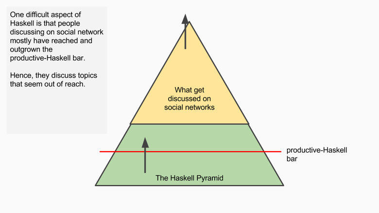

---

# Emphasis on **what**, less focus on **why?**

---

# Our plan for today

1. Coding Dojo / Hack day
2. Real world example
  - problem
  - approach
  - consequences

---

# Does writing code sucks?

---

# [fit] Why writing code sucks (sometimes)?

---

# Coding Kata: Write a sorting algorithm

---

> "As a Billing System user I want to generate an invoice for a given account based on its current system use"

---

# Functions and their nature

1. Manipulate data (`f :: Input -> Output`)
2. Interact with an outside world

---

```haskell
doStuff :: Int -> Int
doStuff i = i + 1
```

# [fit] Why this function is soooo good?

+ easy to test
+ you will be notified if its behavior changes

---

# It's easy to maintain function if it only manipulates data.

---

```haskell
-- | take an Int (i) and UUID (uuid) as parameters
-- | fetch existing Int under given uuid from MongoDB
-- | (if does not exist, default to zero)
-- | add them, store the result, return result as text
doStuff :: UUID -> Int -> IO String
doStuff uuid i = do
  maybeOld <- fetch uuid
  let
    oldI = maybe 0 id maybeOld
    newI = oldI + i
  persist uuid newI
  pure ("New value: " ++ (show newI))
```

---

# It's easy to test and maintain function if it only manipulates data.

# Can we change "interactions with the outside world" into data?

---

```haskell
-- | take an Int (i) and UUID (uuid) as parameters
-- | fetch existing Int under given uuid from MongoDB
-- | (if does not exist, default to zero)
-- | add them, store the result, return result as text
doStuff :: UUID -> Int -> IO String
doStuff uuid i = do
  maybeOld <- fetch uuid
  let
    oldI = maybe 0 id maybeOld
    newI = oldI + i
  persist uuid newI
  pure ("New value: " ++ (show newI))
```

---

# [fit] Let's start with something simple

---

```haskell
-- | take Int, return +1 as text
doStuff :: Int -> String
doStuff i = "New value: " ++ (show $ i + 1)
```

---

```haskell
prop_returns_plus1 :: Property
prop_returns_plus1 = property do
  -- given
  i <- Gen.int
  -- when
  let res = doStuff i
  -- then
  res === "New value: " ++ (show $ i + 1)
```

---

```haskell
module Main where

main :: IO ()
main = putStrLn $ doStuff 10
```

---

```haskell
-- | take Int, return +1 as text
doStuff :: Int -> String
doStuff i = "New value: " ++ (show $ i + 1)
```

---
[.code-highlight: 1]
```haskell
-- | take Int, return +1 as text
doStuff :: Int -> String
doStuff i = "New value: " ++ (show $ i + 1)
```

---
[.code-highlight: 1]

```haskell
-- | take Int, store it, return +1 as text
doStuff :: Int -> String
doStuff i = "New value: " ++ (show $ i + 1)
```

---

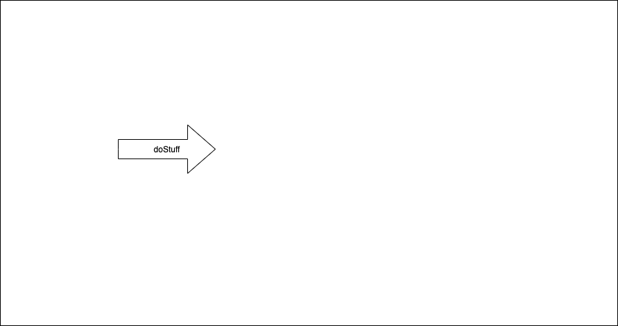

---

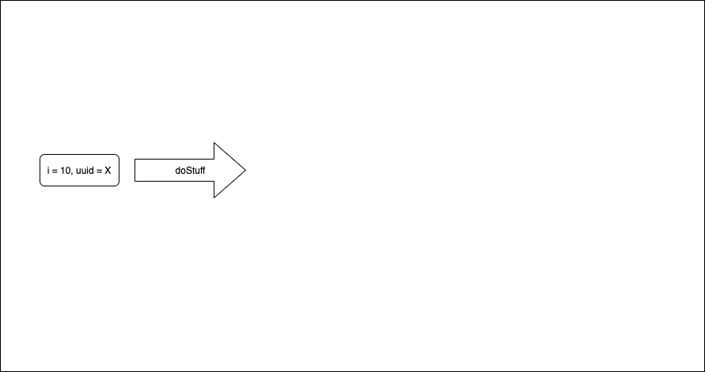

---

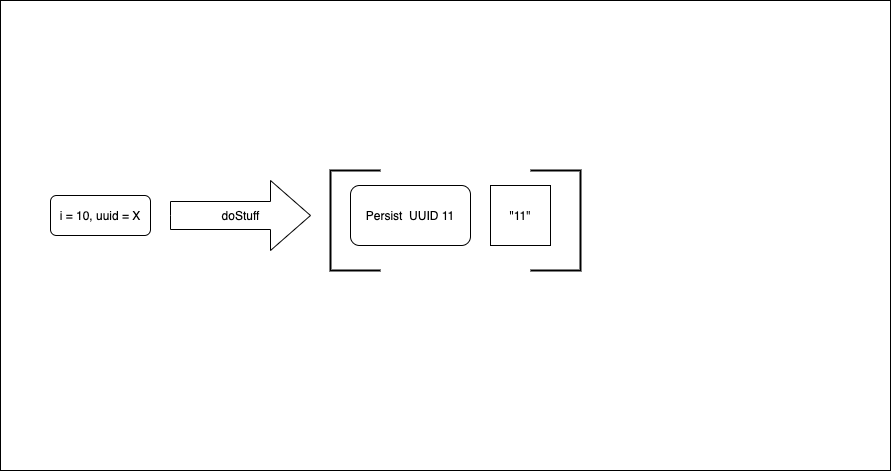

---


---


---

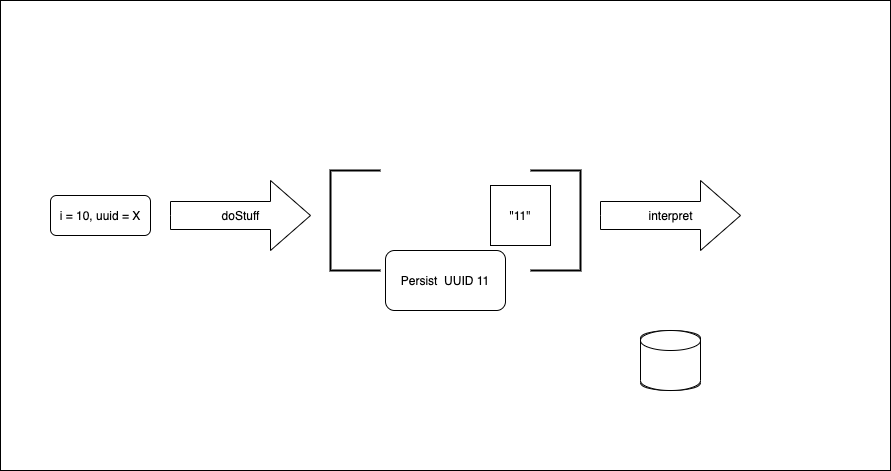

---

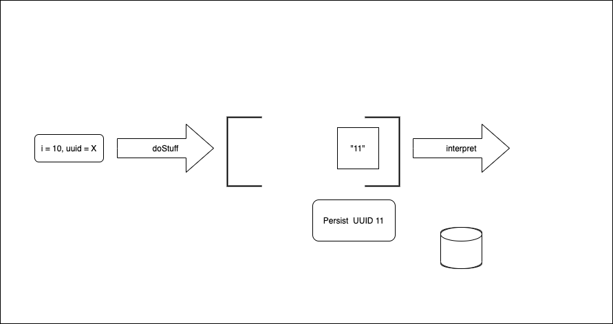

---

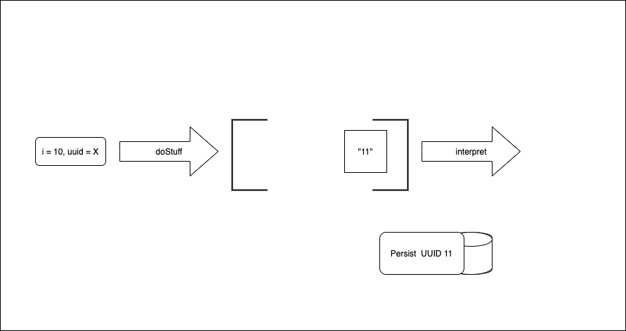

---

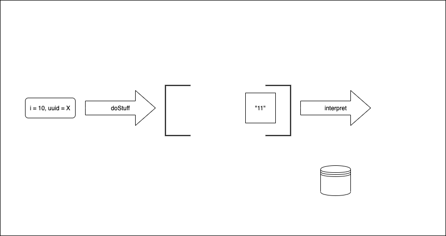

---

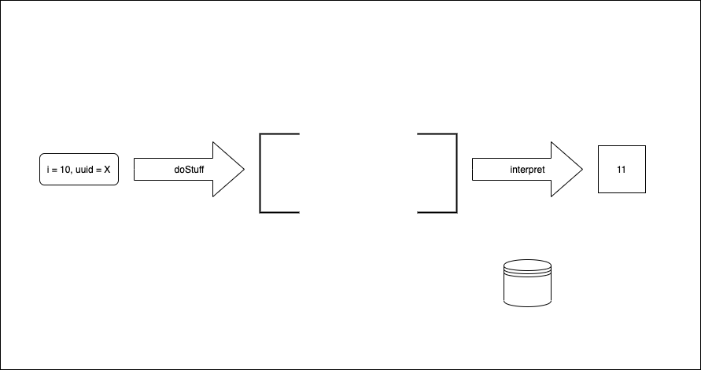

---

```haskell
data Storage = Persist UUID Int
```

[.code-highlight: 1-2]
```haskell
-- | take Int, store it, return +1 as text
doStuff :: UUID -> Int -> (Storage, String)
doStuff uuid i =
  ( Persist uuid newI
  , "New value: " ++ (show newI)
  )
  where
    newI = i + 1
```

---

```haskell
data Storage = Persist UUID Int
```

```haskell
-- | take Int, store it, return +1 as text
doStuff :: UUID -> Int -> (Storage, String)
doStuff uuid i =
  ( Persist uuid newI
  , "New value: " ++ (show newI)
  )
  where
    newI = i + 1
```

---

```haskell
prop_returns_plus1 :: Property
prop_returns_plus1 = property $ do
  -- given
  i    <- Gen.int
  uuid <- genUUID
  -- when
  let result = doStuff uuid i
  -- then
  let expected = ( Persist uuid (i + 1)
                 , "New value: " ++ (show $ i + 1)
                 )
  result === expected
```

---


---


---

```haskell
doStuff   :: UUID -> Int -> (Storage, String)
interpret ::                (Storage, String) -> IO String
```

---

```haskell
type InMemStorage = M.Map UUID Int

interpret ::
     IORef InMemStorage
  -> (Storage, String)
  -> IO String
interpret ioRef (Persist uuid pi, i) = do
  modifyIORef ioRef (M.insert uuid pi)
  return i
```

---

```haskell
main :: IO ()
main = do
  ioRef <- newIORef M.empty
  uuid  <- nextRandom
  res   <- interpret ioRef (doStuff uuid 10)
  putStrLn res
```

---

```haskell
-- | take Int, store it,                      return +1 as text
doStuff :: UUID -> Int -> (Storage, String)
doStuff uuid i =
  ( Persist uuid newI
  , "New value: " ++ (show newI)
  )
  where
    newI = i + 1
```

---

```haskell
-- | take Int, store it once, story it twice, return +1 as text
doStuff :: UUID -> Int -> (Storage, String)
doStuff uuid i =
  ( Persist uuid newI
  , "New value: " ++ (show newI)
  )
  where
    newI = i + 1
```

---

```haskell
-- | take Int, store it once, story it twice, return +1 as text
doStuff :: UUID -> Int -> ([Storage], String)
doStuff uuid i =
  ( [(Persist uuid newI)]
  , "New value: " ++ (show newI)
  )
  where
    newI = i + 1
```

---


---

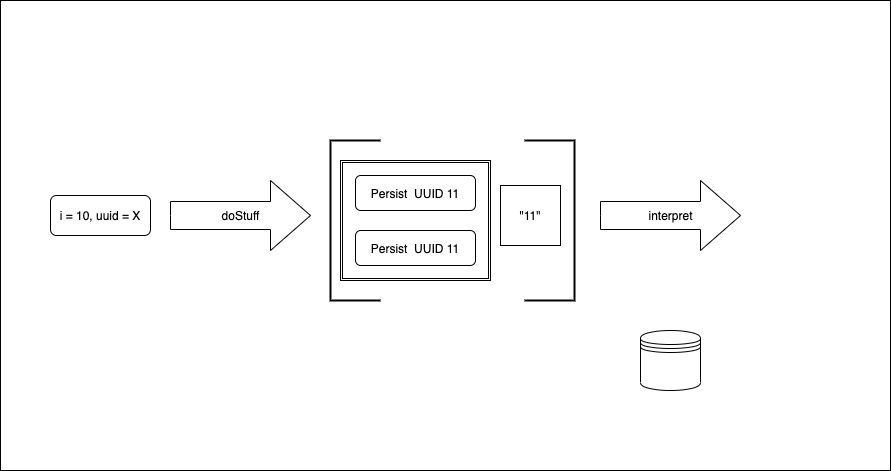

---

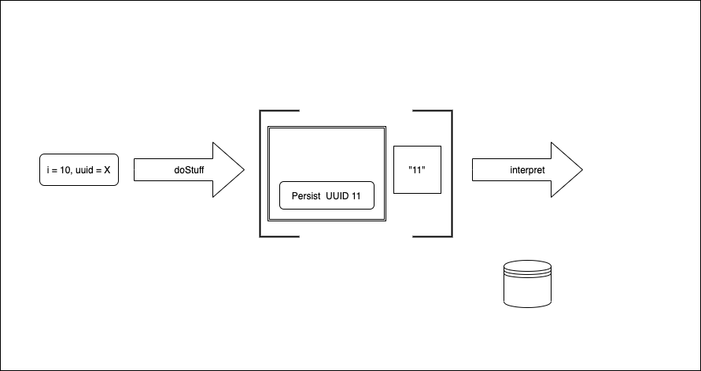

---

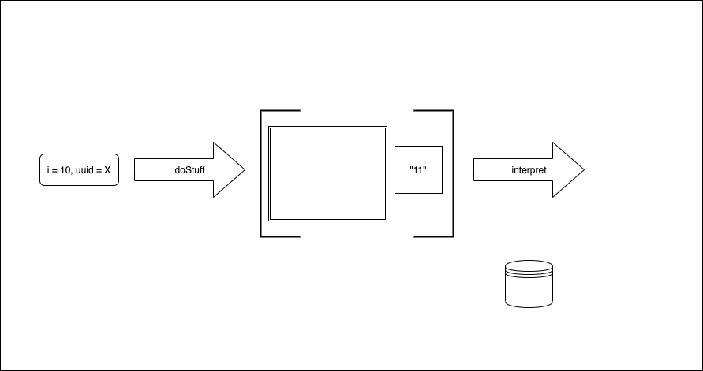

---

```haskell
type InMemStorage = M.Map UUID Int

interpret ::
     IORef InMemStorage
  -> (Storage, String)
  -> IO String
interpret ioRef (Persist uuid pi, i) = do
  modifyIORef ioRef (M.insert uuid pi)
  return i
```

---

```haskell
type InMemStorage = M.Map UUID Int

interpret ::
     IORef InMemStorage
  -> ([Storage], String)
  -> IO String
interpret ioRef (actions, i) = do
  traverse perform actions
  return i
  where
    perform (Persist uuid pi) =
	  modifyIORef ioRef (M.insert uuid pi)
```

---

```haskell
prop_returns_plus1 :: Property
prop_returns_plus1 = property $ do
  -- given
  i    <- Gen.int
  uuid <- genUUID
  -- when
  let result = doStuff uuid i
  -- then
  let expected = ( Persist uuid (i + 1)
                 , "New value: " ++ (show $ i + 1)
                 )
  result === expected
```

---

```haskell
prop_returns_plus1 :: Property
prop_returns_plus1 = property $ do
  -- given
  i    <- Gen.int
  uuid <- genUUID
  -- when
  let result = doStuff uuid i
  -- then
  let expected = ( [Persist uuid (i + 1)]
                 , "New value: " ++ (show $ i + 1)
                 )
  result === expected
```

---

```haskell
main :: IO ()
main = do
  ioRef <- newIORef M.empty
  uuid  <- nextRandom
  res   <- interpret ioRef (doStuff uuid 10)
  putStrLn res
```

---

```haskell
-- | take Int, store it once, story it twice, return +1 as text
doStuff :: UUID -> Int -> ([Storage], String)
doStuff uuid i =
  ( [(Persist uuid newI)]
  , "New value: " ++ (show newI)
  )
  where
    newI = i + 1
```

---

```haskell
-- | take Int, store it once, story it twice, return +1 as text
doStuff :: UUID -> Int -> ([Storage], String)
doStuff uuid i =
  ( [ (Persist uuid newI)
    , (Persist uuid newI)
    ]
  , "New value: " ++ (show newI)
  )
  where
    newI = i + 1
```

---

```haskell
prop_returns_plus1 :: Property
prop_returns_plus1 = property $ do
  -- given
  i    <- Gen.int
  uuid <- genUUID
  -- when
  let result = doStuff uuid i
  -- then
  let expected = ( [Persist uuid (i + 1)]
                 , "New value: " ++ (show $ i + 1)
                 )
  result === expected
```

---

```haskell
prop_returns_plus1 :: Property
prop_returns_plus1 = property $ do
  -- given
  i    <- Gen.int
  uuid <- genUUID
  -- when
  let result = doStuff uuid i
  -- then
  let expected = ( [ Persist uuid (i + 1)
                   , Persist uuid (i + 1)]
                 , "New value: " ++ (show $ i + 1)
                 )
  result === expected
```

---

```haskell
doStuff   :: UUID -> Int -> ([Storage], String)
interpret ::                ([Storage], String) -> IO String
```

---

```haskell
sthElse   :: UUID -> Int -> ([Storage], Int)
interpret ::                ([Storage], String) -> IO String
```

---

```haskell
sthElse   :: UUID -> Int -> ([Storage], Int)
interpret ::                ([Storage], a)      ->      IO a
```

---

```haskell
type InMemStorage = M.Map UUID Int

interpret ::
     IORef InMemStorage
  -> ([Storage], String)
  -> IO String
interpret ioRef (actions, i) = do
  traverse perform actions
  return i
  where
    perform (Persist uuid pi) =
	  modifyIORef ioRef (M.insert uuid pi)
```

---

```haskell
type InMemStorage = M.Map UUID Int

interpret ::
     IORef InMemStorage
  -> ([Storage], a)
  -> IO a
interpret ioRef (actions, i) = do
  traverse perform actions
  return i
  where
    perform (Persist uuid pi) =
	  modifyIORef ioRef (M.insert uuid pi)
```

---

```haskell
data Storage k =

  Persist UUID Int
  deriving stock (Eq, Show)

-- | take Int, store it once, story it twice, return +1 as text
doStuff :: UUID -> Int -> ([Storage], String)
doStuff uuid i =
  ( [ (Persist uuid newI)
    , (Persist uuid newI)
    ]
  , "New value: " ++ (show newI)
  )
  where
    newI = i + 1
```

---

```haskell
data Storage k =
    Done k
  | Persist UUID Int
  deriving stock (Eq, Show)

-- | take Int, store it once, story it twice, return +1 as text
doStuff :: UUID -> Int -> [Storage String]
doStuff uuid i =
   [  (Persist uuid newI)
    , (Persist uuid newI)
    , (Done $ "New value: " ++ (show newI))]
  where
    newI = i + 1
```

---

```haskell
interpret ::
     IORef InMemStorage
  -> ([Storage], a)
  -> IO a
interpret ioRef (actions, i) = do
  traverse perform actions
  return i
  where
    perform (Persist uuid pi) =
	  modifyIORef ioRef (M.insert uuid pi)
```

---

```haskell
interpret ::
     IORef InMemStorage
  -> [Storage a]
  -> IO a
interpret ioRef actions = do
  traverse perform (init actions)
  value (last actions)
  where
    perform (Persist uuid pi) =
	  modifyIORef ioRef (M.insert uuid pi)
    value (Done a) = pure a
    value _        = fail "failed"
```

---
[.code-highlight: 1-4]
```haskell
data Storage k =
    Done k
  | Persist UUID Int
  deriving stock (Eq, Show)

-- | take Int, store it once, story it twice, return +1 as text
doStuff :: UUID -> Int -> [Storage String]
doStuff uuid i =
   [  (Persist uuid newI)
    , (Persist uuid newI)
    , (Done $ "New value: " ++ (show newI))
    ]
  where
    newI = i + 1
```

---

[.code-highlight: 1-4]
```haskell
data Storage k =
    Done k
  | Persist UUID Int (Storage k)
  deriving stock (Eq, Show)

-- | take Int, store it once, story it twice, return +1 as text
doStuff :: UUID -> Int -> [Storage String]
doStuff uuid i =
   [  (Persist uuid newI)
    , (Persist uuid newI)
    , (Done $ "New value: " ++ (show newI))
    ]
  where
    newI = i + 1
```
---

```haskell
data Storage k =
    Done k
  | Persist UUID Int (Storage k)
  deriving stock (Eq, Show)

-- | take Int, store it once, story it twice, return +1 as text
doStuff :: UUID -> Int -> [Storage String]
doStuff uuid i =
   [  (Persist uuid newI)
    , (Persist uuid newI)
    , (Done $ "New value: " ++ (show newI))
    ]
  where
    newI = i + 1
```
---

```haskell

data Storage k =
    Done k
  | Persist UUID Int (Storage k)
  deriving stock (Eq, Show)

-- | take Int, store it once, story it twice, return +1 as text
doStuff :: UUID -> Int -> Storage String
doStuff uuid i =
  (Persist uuid newI
      (Persist uuid newI
          (Done $ "New value: " ++ (show newI))
  ))
  where
    newI = i + 1
```

---

```haskell
interpret :: IORef InMemStorage -> Storage a -> IO a
interpret ioRef (Done a) = pure a
interpret ioRef (Persist uuid i next) =
  modifyIORef ioRef (M.insert uuid i) *>
  interpret ioRef next
```

---

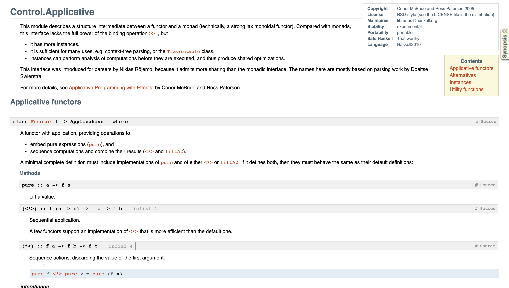

---


---

```haskell
interpret :: IORef InMemStorage -> Storage a -> IO a
interpret ioRef (Done a) = pure a
interpret ioRef (Persist uuid i next) =
  modifyIORef ioRef (M.insert uuid i) *>
  interpret ioRef next
```

---

```haskell
data Storage k =
    Done k
  | Persist UUID Int (Storage k)
  deriving stock (Eq, Show)

-- | take Int, store it once, story it twice, return +1 as text
doStuff :: UUID -> Int -> Storage String
doStuff uuid i =
  (Persist uuid newI
      (Persist uuid newI
          (Done $ "New value: " ++ (show newI))
  ))
  where
    newI = i + 1
```

---

```haskell
data Storage k =
    Done k
  | Persist UUID Int (Storage k)
  deriving stock (Eq, Show)
```

---

```haskell
data Storage k =
    Done k
  | Persist UUID Int (Storage k)
  deriving stock (Functor, Eq, Show)

```

---

```haskell
data Storage k =
    Done k
  | Persist UUID Int (Storage k)
  deriving stock (Functor, Eq, Show)

instance Applicative Storage where
  pure a = Done a
  (<*>) func (Done a)              =
    fmap (\f -> f a) func
  (<*>) func (Persist uuid i next) =
    Persist uuid i (func <*> next)
```

---

```haskell
-- | take Int, store it once, story it twice, return +1 as text
doStuff :: UUID -> Int -> Storage String
doStuff uuid i =
  (Persist uuid newI
      (Persist uuid newI
          (Done $ "New value: " ++ (show newI))
  ))
  where
    newI = i + 1
```

---

```haskell
-- | take Int, store it once, story it twice, return +1 as text
doStuff :: UUID -> Int -> Storage String
doStuff uuid i =
  Persist uuid newI (Done ()) *>
  Persist uuid newI (Done ()) *>
  pure ("New value: " ++ (show newI))
  where
    newI = i + 1
```

---

```haskell
-- | take Int, store it once, story it twice, return +1 as text
doStuff :: UUID -> Int -> Storage String
doStuff uuid i =
  persist uuid newI *>
  persist uuid newI *>
  pure ("New value: " ++ (show newI))
  where
    newI = i + 1

persist :: UUID -> Int -> Storage ()
persist uuid i = Persist uuid i (Done ())
```

---
[.code-highlight: 1-3]
```haskell
-- | take Int, fetch existing Int (if does not exist, default to zero)
-- | add them, store the result, return result as text
doStuff :: UUID -> Int -> Storage String
doStuff uuid i =
  fetch uuid *>
  persist ...

data Storage k =
    Done k
  | Persist UUID Int (Storage k)
  | Fetch UUID ...
  deriving stock (Functor)

fetch :: UUID -> Storage (Maybe Int)
```

---
[.code-highlight: 1-3, 8-10, 12]
```haskell
-- | take Int, fetch existing Int (if does not exist, default to zero)
-- | add them, store the result, return result as text
doStuff :: UUID -> Int -> Storage String
doStuff uuid i =
  fetch uuid *>
  persist ...

data Storage k =
    Done k
  | Persist UUID Int (Storage k)
  | Fetch UUID ...
  deriving stock (Functor)

fetch :: UUID -> Storage (Maybe Int)
```

---
[.code-highlight: 1-3, 8-12]
```haskell
-- | take Int, fetch existing Int (if does not exist, default to zero)
-- | add them, store the result, return result as text
doStuff :: UUID -> Int -> Storage String
doStuff uuid i =
  fetch uuid *>
  persist ...

data Storage k =
    Done k
  | Persist UUID Int (Storage k)
  | Fetch UUID ...
  deriving stock (Functor)

fetch :: UUID -> Storage (Maybe Int)
```

---

[.code-highlight: 1-3, 8-14]
```haskell
-- | take Int, fetch existing Int (if does not exist, default to zero)
-- | add them, store the result, return result as text
doStuff :: UUID -> Int -> Storage String
doStuff uuid i =
  fetch uuid *>
  persist ...

data Storage k =
    Done k
  | Persist UUID Int (Storage k)
  | Fetch UUID ...
  deriving stock (Functor)

fetch :: UUID -> Storage (Maybe Int)
```

---
```haskell
-- | take Int, fetch existing Int (if does not exist, default to zero)
-- | add them, store the result, return result as text
doStuff :: UUID -> Int -> Storage String
doStuff uuid i =
  fetch uuid *>
  persist ...

data Storage k =
    Done k
  | Persist UUID Int (Storage k)
  | Fetch UUID ...
  deriving stock (Functor)

fetch :: UUID -> Storage (Maybe Int)
```

---

```haskell
data Storage k =
    Done k
  | Persist UUID Int (Storage k)
  deriving stock (Functor)
```

---

```haskell
data Storage k =
    Done k
  | Persist UUID Int (Storage k)
  | Fetch UUID (Maybe Int -> Storage k)
  deriving stock (Functor)
```

---

```haskell
data Storage k =
    Done k
  | Persist UUID Int (Storage k)
  | Fetch UUID (Maybe Int -> Storage k)
  deriving stock (Functor)

persist :: UUID -> Int -> Storage ()
persist uuid i = Persist uuid i (Done ())

fetch :: UUID -> Storage (Maybe Int)
fetch uuid = Fetch uuid pure
```

---

> "Sequentially compose two actions, passing any value produced by the first as an argument to the second."

---

# [fit] ??? :: *m a -> (a -> m b) -> m b*

---

# [fit] **>>=** :: *m a -> (a -> m b) -> m b*


---
```haskell
instance Monad Storage where
  (Done a) >>= f = f a
  (Persist uuid i next) >>= f =
    Persist uuid i (next >>= f)
  (Fetch uuid nextFunc) >>= f =
    Fetch uuid (\mi -> (nextFunc mi) >>= f)
```

---

```haskell
-- | take Int, fetch existing Int
-- | (if does not exist, default to zero)
-- | add them,
-- | store the result,
-- | return result as text
doStuff :: UUID -> Int -> Storage String
doStuff uuid i = do
  maybeOld <- fetch uuid
  let
    oldI = maybe 0 id maybeOld
    newI = oldI + i
  persist uuid newI
  pure ("New value: " ++ (show newI))
```

---

```haskell
type InMemStorage = M.Map UUID Int

interpret :: IORef InMemStorage -> Storage a -> IO a
interpret ioRef (Done a) = pure a
interpret ioRef (Persist uuid i next) =
  (modifyIORef ioRef (M.insert uuid i)) *> (interpret ioRef next)
interpret ioRef (Fetch uuid nextFunc) = do
  inmem <- readIORef ioRef
  let maybeI = M.lookup uuid inmem
  interpret ioRef (nextFunc maybeI)
```

---

```haskell
prop_fetch_add_store_return :: Property
prop_fetch_add_store_return = property $ do
  -- given
  i       <- Gen.int
  uuid    <- genUUID
  initial <- Gen.int
  ioRef   <- evalIO $ newIORef $ M.singleton uuid initial
  -- when
  res     <- evalIO $ interpret ioRef (doStuff uuid i)
  -- then
  inmem   <- evalIO $ readIORef ioRef
  res            === "New value: " ++ show (i + initial)
  M.toList inmem === [(uuid, i + initial)]
```

---

```haskell
doStuff :: UUID -> Int -> IO String
doStuff uuid i = do
  maybeOld <- fetch uuid
  let
    oldI = maybe 0 id maybeOld
    newI = oldI + i
  persist uuid newI
  pure ("New value: " ++ (show newI))
```

---

```haskell
doStuff :: UUID -> Int -> Storage String
doStuff uuid i = do
  maybeOld <- fetch uuid
  let
    oldI = maybe 0 id maybeOld
    newI = oldI + i
  persist uuid newI
  pure ("New value: " ++ (show newI))
```

---

```haskell
data Storage k =
    Done k
  | Persist UUID Int (Storage k)
  | Fetch UUID (Maybe Int -> Storage k)
  deriving stock (Functor)

instance Applicative Storage where
  pure a = Done a
  (<*>) func (Done a)              = fmap (\f -> f a) func
  (<*>) func (Persist uuid i next) = Persist uuid i (func <*> next)

instance Monad Storage where
  (Done a) >>= f = f a
  (Persist uuid i next) >>= f = Persist uuid i (next >>= f)
  (Fetch uuid nextFunc) >>= f = Fetch uuid (\mi -> (nextFunc mi) >>= f)
```

---

```haskell
data Storage k =
    Done k
  | Persist UUID Int (Storage k)
  | Fetch UUID (Maybe Int -> Storage k)
  deriving stock (Functor)
```

---

```haskell
data Storage k =
    Persist UUID Int k
  | Fetch UUID (Maybe Int -> k)
  deriving stock (Functor)

data Free (f:: * -> *) (k :: *) =
  Pure k |
  Impure (f (Free f k))

```

---

```haskell
data Storage k =
    Persist UUID Int k
  | Fetch UUID (Maybe Int -> k)
  deriving stock (Functor)

data Free (f:: * -> *) (k :: *) =
  Pure k |
  Impure (f (Free f k))

persist :: UUID -> Int -> Free Storage ()
persist uuid i = Impure (Persist uuid i (Pure ()))

fetch :: UUID -> Free Storage (Maybe Int)
fetch uuid = Impure (Fetch uuid (\mi -> Pure mi))
```

---

```haskell
instance Functor f => Functor (Free f) where
  fmap f (Pure k)   = Pure $ f k
  fmap f (Impure c) = Impure (fmap (fmap f) c)

instance Functor f => Applicative (Free f) where
  pure a = Pure a
  (<*>) func (Pure a)   = fmap (\f -> f a) func
  (<*>) func (Impure c) = Impure (fmap (\f -> func <*> f) c)

instance Functor f => Monad (Free f) where
  Pure k >>= f = f k
  Impure c >>= f = Impure $ fmap (\x -> x >>= f) c
```

---

```haskell
data Storage k =
    Persist UUID Int k
  | Fetch UUID (Maybe Int -> k)
  deriving stock (Functor)
```

---

```haskell
doStuff :: UUID -> Int -> Storage String
doStuff uuid i = do
  maybeOld <- fetch uuid
  let
    oldI = maybe 0 id maybeOld
    newI = oldI + i
  persist uuid newI
  pure ("New value: " ++ (show newI))
```

---

```haskell
doStuff :: UUID -> Int -> Free Storage String
doStuff uuid i = do
  maybeOld <- fetch uuid
  let
    oldI = maybe 0 id maybeOld
    newI = oldI + i
  persist uuid newI
  pure ("New value: " ++ (show newI))
```

---

```haskell
interpretFree ::
  Monad m
  => (forall x. f x -> m x)
  -> Free f a
  -> m a
interpretFree _ (Pure a)   = pure a
interpretFree f (Impure c) = f c >>= interpretFree f

interpret :: IORef InMemStorage -> Storage a -> IO a
interpret ioRef (Persist uuid i k) = do
  modifyIORef ioRef (M.insert uuid i)
  pure k
interpret ioRef (Fetch uuid kFunc) = do
  inmem <- readIORef ioRef
  let maybeI = M.lookup uuid inmem
  pure $ kFunc maybeI
```

---

```haskell
interpretFree :: Monad m => (forall x. f x -> m x) -> Free f a -> m a
interpret :: IORef InMemStorage -> Storage a -> IO a
```

---
```haskell
interpretFree ::                        (f x ->  m x) -> Free f a         -> m a
interpret :: IORef InMemStorage -> Storage a -> IO a
```
---
```haskell
interpretFree ::                        (f x ->  m x) -> Free f a         -> m a
interpret :: IORef InMemStorage -> Storage a -> IO a

interpreter :: Free Storage a -> IO a
```
---

```haskell
prop_fetch_add_store_return :: Property
prop_fetch_add_store_return = property $ do
  -- given
  i       <- Gen.int
  uuid    <- genUUID
  initial <- Gen.int
  ioRef   <- evalIO $ newIORef $ M.singleton uuid initial
  -- when
  res     <- evalIO $ interpret ioRef (doStuff uuid i)
  -- then
  inmem   <- evalIO $ readIORef ioRef
  res            === "New value: " ++ show (i + initial)
  M.toList inmem === [(uuid, i + initial)]
```

---

```haskell
prop_fetch_add_store_return :: Property
prop_fetch_add_store_return = property $ do
  -- given
  i       <- Gen.int
  uuid    <- genUUID
  initial <- Gen.int
  ioRef   <- evalIO $ newIORef $ M.singleton uuid initial
  -- when
  res     <- evalIO $ interpret (interpret ioRef) (doStuff uuid i)
  -- then
  inmem   <- evalIO $ readIORef ioRef
  res            === "New value: " ++ show (i + initial)
  M.toList inmem === [(uuid, i + initial)]
```

---

# [fit] Free Monads?

---

> "As a Billing System user I want to generate an invoice for a given account based on its current system use"


---
# Resources


+ [Urban Expansion](https://www.youtube.com/watch?v=AqUSo2hstHI)
+ [Haskell Pyramid](https://patrickmn.com/software/the-haskell-pyramid/)
