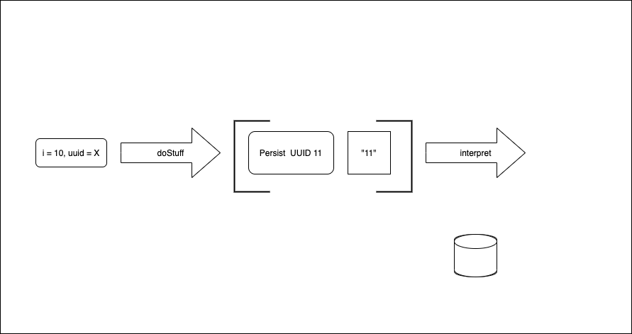
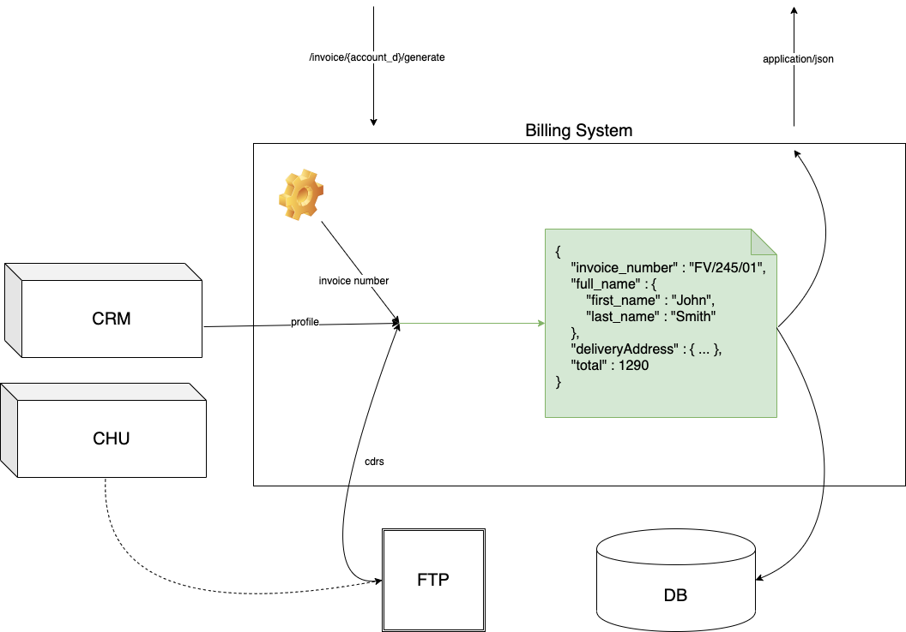
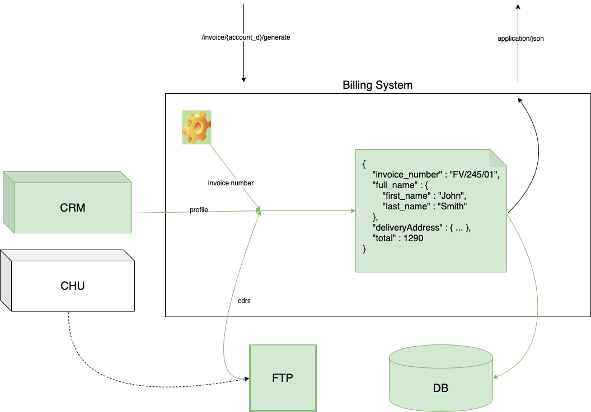

build-lists: false
footer: © Pawel Szulc, @EncodePanda, paul.szulc@gmail.com
slidenumbers: true

# [fit] Maintainable Software Architeture

# in Haskell (with Polysemy)

---

**maintain** *[ meyn-teyn ]*

*verb (used with object)*
1. to keep in existence
2. to keep in an appropriate condition, operation, or force; keep unimpaired:
3. to keep in a specified state, position, etc.

---

**maintain** *[ meyn-teyn ]*

*verb (used with object)*
1. to keep in **existence**
2. to keep in **an appropriate condition**, operation, or force; keep unimpaired:
3. to keep in a specified state, position, etc.

---

**maintain** *[ meyn-teyn ]*

*verb (used with object)*
1. to keep in **existence**
2. to keep in **an appropriate condition**, operation, or force; keep unimpaired:
3. to keep in a specified state, position, etc.

## ... in **Haskell**?

---

> "~~Socialism~~ Haskell is a ~~system~~ language which heroically overcomes difficulties unknown in any other ~~system~~ language"

---


---

# Emphasis on **what**, less focus on **why?**

---

# [fit] Maintainable Software Architeture

# in Haskell

---

# Our plan for today

1. Coding Dojo / Hack day
2. Real world example
  - problem
  - approach
  - consequences
  - Polysemy

---

# Does writing code sucks?

---

# [fit] Why writing code sucks (sometimes)?

---

# Coding Kata: Write a sorting algorithm

---

> "As a Billing System user I want to generate an invoice for a given account based on its current system use"

---
[.build-lists: true]
# Functions and their nature

1. Manipulate data (`f :: Input -> Output`)
2. Interact with an outside world

---

[.build-lists: true]
```haskell
doStuff :: Int -> Int
doStuff i = i + 1
```

# [fit] Why this function is soooo good?

+ easy to test
+ you will be notified if its behavior changes

---

# It's easy to maintain function if it only manipulates data.

---

```haskell
-- | take an Int (i) and UUID (uuid) as parameters
-- | fetch existing Int under given uuid from MongoDB
-- | (if does not exist, default to zero)
-- | add them, store the result, return result as text
doStuff :: UUID -> Int -> IO String
doStuff uuid i = do
  maybeOld <- fetch uuid
  let
    oldI = maybe 0 id maybeOld
    newI = oldI + i
  persist uuid newI
  pure ("New value: " ++ (show newI))
```

---
[.code-highlight: 1,5-6]

```haskell
-- | take an Int (i) and UUID (uuid) as parameters
-- | fetch existing Int under given uuid from MongoDB
-- | (if does not exist, default to zero)
-- | add them, store the result, return result as text
doStuff :: UUID -> Int -> IO String
doStuff uuid i = do
  maybeOld <- fetch uuid
  let
    oldI = maybe 0 id maybeOld
    newI = oldI + i
  persist uuid newI
  pure ("New value: " ++ (show newI))
```

---
[.code-highlight: 2,7]
```haskell
-- | take an Int (i) and UUID (uuid) as parameters
-- | fetch existing Int under given uuid from MongoDB
-- | (if does not exist, default to zero)
-- | add them, store the result, return result as text
doStuff :: UUID -> Int -> IO String
doStuff uuid i = do
  maybeOld <- fetch uuid
  let
    oldI = maybe 0 id maybeOld
    newI = oldI + i
  persist uuid newI
  pure ("New value: " ++ (show newI))
```

---
[.code-highlight: 3,8-9]
```haskell
-- | take an Int (i) and UUID (uuid) as parameters
-- | fetch existing Int under given uuid from MongoDB
-- | (if does not exist, default to zero)
-- | add them, store the result, return result as text
doStuff :: UUID -> Int -> IO String
doStuff uuid i = do
  maybeOld <- fetch uuid
  let
    oldI = maybe 0 id maybeOld
    newI = oldI + i
  persist uuid newI
  pure ("New value: " ++ (show newI))
```

---
[.code-highlight: 4,10-12]
```haskell
-- | take an Int (i) and UUID (uuid) as parameters
-- | fetch existing Int under given uuid from MongoDB
-- | (if does not exist, default to zero)
-- | add them, store the result, return result as text
doStuff :: UUID -> Int -> IO String
doStuff uuid i = do
  maybeOld <- fetch uuid
  let
    oldI = maybe 0 id maybeOld
    newI = oldI + i
  persist uuid newI
  pure ("New value: " ++ (show newI))
```

---

```haskell
-- | take an Int (i) and UUID (uuid) as parameters
-- | fetch existing Int under given uuid from MongoDB
-- | (if does not exist, default to zero)
-- | add them, store the result, return result as text
doStuff :: UUID -> Int -> IO String
doStuff uuid i = do
  maybeOld <- fetch uuid
  let
    oldI = maybe 0 id maybeOld
    newI = oldI + i
  persist uuid newI
  pure ("New value: " ++ (show newI))
```

---

# It's easy to test and maintain function if it only manipulates data.

# Can we change "interactions with the outside world" into data?

---

```haskell
-- | take an Int (i) and UUID (uuid) as parameters
-- | fetch existing Int under given uuid from MongoDB
-- | (if does not exist, default to zero)
-- | add them, store the result, return result as text
doStuff :: UUID -> Int -> IO String
doStuff uuid i = do
  maybeOld <- fetch uuid
  let
    oldI = maybe 0 id maybeOld
    newI = oldI + i
  persist uuid newI
  pure ("New value: " ++ (show newI))
```

---

# [fit] Let's start with something simple

---

```haskell
-- | take Int, return +1 as text
doStuff :: Int -> String
doStuff i = "New value: " ++ (show $ i + 1)
```

---

```haskell
prop_returns_plus1 :: Property
prop_returns_plus1 = property do
  -- given
  i <- Gen.int
  -- when
  let res = doStuff i
  -- then
  res === "New value: " ++ (show $ i + 1)
```

---

```haskell
module Main where

main :: IO ()
main = putStrLn $ doStuff 10
```

---

```haskell
-- | take Int, return +1 as text
doStuff :: Int -> String
doStuff i = "New value: " ++ (show $ i + 1)
```

---
[.code-highlight: 1]
```haskell
-- | take Int, return +1 as text
doStuff :: Int -> String
doStuff i = "New value: " ++ (show $ i + 1)
```

---
[.code-highlight: 1]

```haskell
-- | take Int, store it, return +1 as text
doStuff :: Int -> String
doStuff i = "New value: " ++ (show $ i + 1)
```

---


---


---


---


---



---


---


---


---


---


---

[.code-highlight: 3-4]
```haskell
data Storage = Persist UUID Int

-- | take Int, store it, return +1 as text
doStuff :: UUID -> Int -> (Storage, String)
doStuff uuid i =
  ( Persist uuid newI
  , "New value: " ++ (show newI)
  )
  where
    newI = i + 1
```

---

[.code-highlight: 1-4]
```haskell
data Storage = Persist UUID Int

-- | take Int, store it, return +1 as text
doStuff :: UUID -> Int -> (Storage, String)
doStuff uuid i =
  ( Persist uuid newI
  , "New value: " ++ (show newI)
  )
  where
    newI = i + 1
```

---

```haskell
data Storage = Persist UUID Int

-- | take Int, store it, return +1 as text
doStuff :: UUID -> Int -> (Storage, String)
doStuff uuid i =
  ( Persist uuid newI
  , "New value: " ++ (show newI)
  )
  where
    newI = i + 1
```

---

```haskell
prop_returns_plus1 :: Property
prop_returns_plus1 = property $ do
  -- given
  i    <- Gen.int
  uuid <- genUUID
  -- when
  let result = doStuff uuid i
  -- then
  let expected = ( Persist uuid (i + 1)
                 , "New value: " ++ (show $ i + 1)
                 )
  result === expected
```

---
[.code-highlight: 4-5]

```haskell
prop_returns_plus1 :: Property
prop_returns_plus1 = property $ do
  -- given
  i    <- Gen.int
  uuid <- genUUID
  -- when
  let result = doStuff uuid i
  -- then
  let expected = ( Persist uuid (i + 1)
                 , "New value: " ++ (show $ i + 1)
                 )
  result === expected
```

---
[.code-highlight: 7]

```haskell
prop_returns_plus1 :: Property
prop_returns_plus1 = property $ do
  -- given
  i    <- Gen.int
  uuid <- genUUID
  -- when
  let result = doStuff uuid i
  -- then
  let expected = ( Persist uuid (i + 1)
                 , "New value: " ++ (show $ i + 1)
                 )
  result === expected
```

---
[.code-highlight: 9-12]

```haskell
prop_returns_plus1 :: Property
prop_returns_plus1 = property $ do
  -- given
  i    <- Gen.int
  uuid <- genUUID
  -- when
  let result = doStuff uuid i
  -- then
  let expected = ( Persist uuid (i + 1)
                 , "New value: " ++ (show $ i + 1)
                 )
  result === expected
```

---

```haskell
prop_returns_plus1 :: Property
prop_returns_plus1 = property $ do
  -- given
  i    <- Gen.int
  uuid <- genUUID
  -- when
  let result = doStuff uuid i
  -- then
  let expected = ( Persist uuid (i + 1)
                 , "New value: " ++ (show $ i + 1)
                 )
  result === expected
```

---


---


---

```haskell
doStuff   :: UUID -> Int -> (Storage, String)
interpret ::                (Storage, String) -> IO String
```

---
[.code-highlight: 3,5-6]

```haskell
type InMemStorage = M.Map UUID Int

interpret ::
     IORef InMemStorage
  -> (Storage, String)
  -> IO String
interpret ioRef (Persist uuid pi, i) = do
  modifyIORef ioRef (M.insert uuid pi)
  return i
```

---

[.code-highlight: 1, 3,5-6]
```haskell
type InMemStorage = M.Map UUID Int

interpret ::
     IORef InMemStorage
  -> (Storage, String)
  -> IO String
interpret ioRef (Persist uuid pi, i) = do
  modifyIORef ioRef (M.insert uuid pi)
  return i
```

---

[.code-highlight: 1-6]
```haskell
type InMemStorage = M.Map UUID Int

interpret ::
     IORef InMemStorage
  -> (Storage, String)
  -> IO String
interpret ioRef (Persist uuid pi, i) = do
  modifyIORef ioRef (M.insert uuid pi)
  return i
```

---

```haskell
type InMemStorage = M.Map UUID Int

interpret ::
     IORef InMemStorage
  -> (Storage, String)
  -> IO String
interpret ioRef (Persist uuid pi, i) = do
  modifyIORef ioRef (M.insert uuid pi)
  return i
```
---

```haskell
main :: IO ()
main = do
  ioRef <- newIORef M.empty
  uuid  <- nextRandom
  res   <- interpret ioRef (doStuff uuid 10)
  putStrLn res
```

---

```haskell
-- | take Int, store it,                      return +1 as text
doStuff :: UUID -> Int -> (Storage, String)
doStuff uuid i =
  ( Persist uuid newI
  , "New value: " ++ (show newI)
  )
  where
    newI = i + 1
```

---

```haskell
-- | take Int, store it once, story it twice, return +1 as text
doStuff :: UUID -> Int -> (Storage, String)
doStuff uuid i =
  ( Persist uuid newI
  , "New value: " ++ (show newI)
  )
  where
    newI = i + 1
```

---

```haskell
-- | take Int, store it once, story it twice, return +1 as text
doStuff :: UUID -> Int -> ([Storage], String)
doStuff uuid i =
  ( [(Persist uuid newI)]
  , "New value: " ++ (show newI)
  )
  where
    newI = i + 1
```

---


---


---


---


---

```haskell
type InMemStorage = M.Map UUID Int

interpret ::
     IORef InMemStorage
  -> (Storage, String)
  -> IO String
interpret ioRef (Persist uuid pi, i) = do
  modifyIORef ioRef (M.insert uuid pi)
  return i
```

---
[.code-highlight: 4-5]

```haskell
type InMemStorage = M.Map UUID Int

interpret ::
     IORef InMemStorage
  -> (Storage, String)
  -> IO String
interpret ioRef (Persist uuid pi, i) = do
  modifyIORef ioRef (M.insert uuid pi)
  return i
```

---

[.code-highlight: 4-5]
```haskell
type InMemStorage = M.Map UUID Int

interpret ::
     IORef InMemStorage
  -> ([Storage], String)
  -> IO String
interpret ioRef (actions, i) = do
  traverse perform actions
  return i
  where
    perform (Persist uuid pi) =
	  modifyIORef ioRef (M.insert uuid pi)
```

---

[.code-highlight: 1-7]
```haskell
type InMemStorage = M.Map UUID Int

interpret ::
     IORef InMemStorage
  -> ([Storage], String)
  -> IO String
interpret ioRef (actions, i) = do
  traverse perform actions
  return i
  where
    perform (Persist uuid pi) =
	  modifyIORef ioRef (M.insert uuid pi)
```

---

[.code-highlight: 7-8]
```haskell
type InMemStorage = M.Map UUID Int

interpret ::
     IORef InMemStorage
  -> ([Storage], String)
  -> IO String
interpret ioRef (actions, i) = do
  traverse perform actions
  return i
  where
    perform (Persist uuid pi) =
	  modifyIORef ioRef (M.insert uuid pi)
```
---

[.code-highlight: 7-8, 11-12]
```haskell
type InMemStorage = M.Map UUID Int

interpret ::
     IORef InMemStorage
  -> ([Storage], String)
  -> IO String
interpret ioRef (actions, i) = do
  traverse perform actions
  return i
  where
    perform (Persist uuid pi) =
	  modifyIORef ioRef (M.insert uuid pi)
```
---

[.code-highlight: 9]
```haskell
type InMemStorage = M.Map UUID Int

interpret ::
     IORef InMemStorage
  -> ([Storage], String)
  -> IO String
interpret ioRef (actions, i) = do
  traverse perform actions
  return i
  where
    perform (Persist uuid pi) =
	  modifyIORef ioRef (M.insert uuid pi)
```

---

```haskell
type InMemStorage = M.Map UUID Int

interpret ::
     IORef InMemStorage
  -> ([Storage], String)
  -> IO String
interpret ioRef (actions, i) = do
  traverse perform actions
  return i
  where
    perform (Persist uuid pi) =
	  modifyIORef ioRef (M.insert uuid pi)
```
---

```haskell
prop_returns_plus1 :: Property
prop_returns_plus1 = property $ do
  -- given
  i    <- Gen.int
  uuid <- genUUID
  -- when
  let result = doStuff uuid i
  -- then
  let expected = ( Persist uuid (i + 1)
                 , "New value: " ++ (show $ i + 1)
                 )
  result === expected
```

---

```haskell
prop_returns_plus1 :: Property
prop_returns_plus1 = property $ do
  -- given
  i    <- Gen.int
  uuid <- genUUID
  -- when
  let result = doStuff uuid i
  -- then
  let expected = ( [Persist uuid (i + 1)]
                 , "New value: " ++ (show $ i + 1)
                 )
  result === expected
```

---

```haskell
main :: IO ()
main = do
  ioRef <- newIORef M.empty
  uuid  <- nextRandom
  res   <- interpret ioRef (doStuff uuid 10)
  putStrLn res
```

---

```haskell
-- | take Int, store it once, story it twice, return +1 as text
doStuff :: UUID -> Int -> ([Storage], String)
doStuff uuid i =
  ( [(Persist uuid newI)]
  , "New value: " ++ (show newI)
  )
  where
    newI = i + 1
```

---

```haskell
-- | take Int, store it once, story it twice, return +1 as text
doStuff :: UUID -> Int -> ([Storage], String)
doStuff uuid i =
  ( [ (Persist uuid newI)
    , (Persist uuid newI)
    ]
  , "New value: " ++ (show newI)
  )
  where
    newI = i + 1
```

---

```haskell
prop_returns_plus1 :: Property
prop_returns_plus1 = property $ do
  -- given
  i    <- Gen.int
  uuid <- genUUID
  -- when
  let result = doStuff uuid i
  -- then
  let expected = ( [Persist uuid (i + 1)]
                 , "New value: " ++ (show $ i + 1)
                 )
  result === expected
```

---

```haskell
prop_returns_plus1 :: Property
prop_returns_plus1 = property $ do
  -- given
  i    <- Gen.int
  uuid <- genUUID
  -- when
  let result = doStuff uuid i
  -- then
  let expected = ( [ Persist uuid (i + 1)
                   , Persist uuid (i + 1)]
                 , "New value: " ++ (show $ i + 1)
                 )
  result === expected
```

---


---

```haskell
doStuff   :: UUID -> Int -> ([Storage], String)
interpret ::                ([Storage], String) -> IO String
```

---

```haskell
sthElse   :: UUID -> Int -> ([Storage], Int)
interpret ::                ([Storage], String) -> IO String
```

---

```haskell
sthElse   :: UUID -> Int -> ([Storage], Int)
interpret ::                ([Storage], a)      ->      IO a
```

---

```haskell
type InMemStorage = M.Map UUID Int

interpret ::
     IORef InMemStorage
  -> ([Storage], String)
  -> IO String
interpret ioRef (actions, i) = do
  traverse perform actions
  return i
  where
    perform (Persist uuid pi) =
	  modifyIORef ioRef (M.insert uuid pi)
```

---

```haskell
type InMemStorage = M.Map UUID Int

interpret ::
     IORef InMemStorage
  -> ([Storage], a)
  -> IO a
interpret ioRef (actions, i) = do
  traverse perform actions
  return i
  where
    perform (Persist uuid pi) =
	  modifyIORef ioRef (M.insert uuid pi)
```

---

```haskell
data Storage k =

  Persist UUID Int
  deriving stock (Eq, Show)

-- | take Int, store it once, story it twice, return +1 as text
doStuff :: UUID -> Int -> ([Storage], String)
doStuff uuid i =
  ( [ (Persist uuid newI)
    , (Persist uuid newI)]
  , "New value: " ++ (show newI)
  )
  where
    newI = i + 1
```

---
[.code-highlight: 9-12]

```haskell
data Storage k =

  Persist UUID Int
  deriving stock (Eq, Show)

-- | take Int, store it once, story it twice, return +1 as text
doStuff :: UUID -> Int -> ([Storage], String)
doStuff uuid i =
  ( [ (Persist uuid newI)
    , (Persist uuid newI)]
  , "New value: " ++ (show newI)
  )
  where
    newI = i + 1
```

---
[.code-highlight: 1,3-4]

```haskell
data Storage k =
    Done k
  | Persist UUID Int
  deriving stock (Eq, Show)

-- | take Int, store it once, story it twice, return +1 as text
doStuff :: UUID -> Int -> [Storage String]
doStuff uuid i =
   [  (Persist uuid newI)
    , (Persist uuid newI)
    , (Done $ "New value: " ++ (show newI))]
  where
    newI = i + 1
```

---

[.code-highlight: 1-4]
```haskell
data Storage k =
    Done k
  | Persist UUID Int
  deriving stock (Eq, Show)

-- | take Int, store it once, story it twice, return +1 as text
doStuff :: UUID -> Int -> [Storage String]
doStuff uuid i =
   [  (Persist uuid newI)
    , (Persist uuid newI)
    , (Done $ "New value: " ++ (show newI))]
  where
    newI = i + 1
```

---

[.code-highlight: 1-4, 9-11]
```haskell
data Storage k =
    Done k
  | Persist UUID Int
  deriving stock (Eq, Show)

-- | take Int, store it once, story it twice, return +1 as text
doStuff :: UUID -> Int -> [Storage String]
doStuff uuid i =
   [  (Persist uuid newI)
    , (Persist uuid newI)
    , (Done $ "New value: " ++ (show newI))]
  where
    newI = i + 1
```

---

```haskell
data Storage k =
    Done k
  | Persist UUID Int
  deriving stock (Eq, Show)

-- | take Int, store it once, story it twice, return +1 as text
doStuff :: UUID -> Int -> [Storage String]
doStuff uuid i =
   [  (Persist uuid newI)
    , (Persist uuid newI)
    , (Done $ "New value: " ++ (show newI))]
  where
    newI = i + 1
```

---

```haskell
interpret ::
     IORef InMemStorage
  -> ([Storage], a)
  -> IO a
interpret ioRef (actions, i) = do
  traverse perform actions
  return i
  where
    perform (Persist uuid pi) =
	  modifyIORef ioRef (M.insert uuid pi)
```

---
[.code-highlight: 3-4]

```haskell
interpret ::
     IORef InMemStorage
  -> ([Storage], a)
  -> IO a
interpret ioRef (actions, i) = do
  traverse perform actions
  return i
  where
    perform (Persist uuid pi) =
	  modifyIORef ioRef (M.insert uuid pi)
```

---
[.code-highlight: 3-4]

```haskell
interpret ::
     IORef InMemStorage
  -> [Storage a]
  -> IO a
interpret ioRef actions = do
  traverse perform (init actions)
  value (last actions)
  where
    perform (Persist uuid pi) =
	  modifyIORef ioRef (M.insert uuid pi)
    value (Done a) = pure a
    value _        = fail "failed"
```
---
[.code-highlight: 6,9-10]

```haskell
interpret ::
     IORef InMemStorage
  -> [Storage a]
  -> IO a
interpret ioRef actions = do
  traverse perform (init actions)
  value (last actions)
  where
    perform (Persist uuid pi) =
	  modifyIORef ioRef (M.insert uuid pi)
    value (Done a) = pure a
    value _        = fail "failed"
```

---
[.code-highlight: 7,11-12]
```haskell
interpret ::
     IORef InMemStorage
  -> [Storage a]
  -> IO a
interpret ioRef actions = do
  traverse perform (init actions)
  value (last actions)
  where
    perform (Persist uuid pi) =
	  modifyIORef ioRef (M.insert uuid pi)
    value (Done a) = pure a
    value _        = fail "failed"
```

---

```haskell
interpret ::
     IORef InMemStorage
  -> [Storage a]
  -> IO a
interpret ioRef actions = do
  traverse perform (init actions)
  value (last actions)
  where
    perform (Persist uuid pi) =
	  modifyIORef ioRef (M.insert uuid pi)
    value (Done a) = pure a
    value _        = fail "failed"
```

---
[.code-highlight: 1-4]
```haskell
data Storage k =
    Done k
  | Persist UUID Int
  deriving stock (Eq, Show)

-- | take Int, store it once, story it twice, return +1 as text
doStuff :: UUID -> Int -> [Storage String]
doStuff uuid i =
   [  (Persist uuid newI)
    , (Persist uuid newI)
    , (Done $ "New value: " ++ (show newI))
    ]
  where
    newI = i + 1
```

---

[.code-highlight: 1-4]
```haskell
data Storage k =
    Done k
  | Persist UUID Int (Storage k)
  deriving stock (Eq, Show)

-- | take Int, store it once, story it twice, return +1 as text
doStuff :: UUID -> Int -> [Storage String]
doStuff uuid i =
   [  (Persist uuid newI)
    , (Persist uuid newI)
    , (Done $ "New value: " ++ (show newI))
    ]
  where
    newI = i + 1
```
---

```haskell
data Storage k =
    Done k
  | Persist UUID Int (Storage k)
  deriving stock (Eq, Show)

-- | take Int, store it once, story it twice, return +1 as text
doStuff :: UUID -> Int -> [Storage String]
doStuff uuid i =
   [  (Persist uuid newI)
    , (Persist uuid newI)
    , (Done $ "New value: " ++ (show newI))
    ]
  where
    newI = i + 1
```

---

```haskell

data Storage k =
    Done k
  | Persist UUID Int (Storage k)
  deriving stock (Eq, Show)

-- | take Int, store it once, story it twice, return +1 as text
doStuff :: UUID -> Int -> Storage String
doStuff uuid i =
  (Persist uuid newI
      (Persist uuid newI
          (Done $ "New value: " ++ (show newI))
  ))
  where
    newI = i + 1
```

---

[.code-highlight: 1-4,9-11]
```haskell
data Storage k =
    Done k
  | Persist UUID Int (Storage k)
  deriving stock (Eq, Show)

-- | take Int, store it once, story it twice, return +1 as text
doStuff :: UUID -> Int -> Storage String
doStuff uuid i =
  (Persist uuid newI
      (Persist uuid newI
          (Done $ "New value: " ++ (show newI))
  ))
  where
    newI = i + 1
```

---
[.code-highlight: 1-4,7]
```haskell

data Storage k =
    Done k
  | Persist UUID Int (Storage k)
  deriving stock (Eq, Show)

-- | take Int, store it once, story it twice, return +1 as text
doStuff :: UUID -> Int -> Storage String
doStuff uuid i =
  (Persist uuid newI
      (Persist uuid newI
          (Done $ "New value: " ++ (show newI))
  ))
  where
    newI = i + 1
```
---

```haskell

data Storage k =
    Done k
  | Persist UUID Int (Storage k)
  deriving stock (Eq, Show)

-- | take Int, store it once, story it twice, return +1 as text
doStuff :: UUID -> Int -> Storage String
doStuff uuid i =
  (Persist uuid newI
      (Persist uuid newI
          (Done $ "New value: " ++ (show newI))
  ))
  where
    newI = i + 1
```

---

```haskell
interpret :: IORef InMemStorage -> Storage a -> IO a
interpret ioRef (Done a) = pure a
interpret ioRef (Persist uuid i next) =
  modifyIORef ioRef (M.insert uuid i) *>
  interpret ioRef next
```

---

[.code-highlight: 2]
```haskell
interpret :: IORef InMemStorage -> Storage a -> IO a
interpret ioRef (Done a) = pure a
interpret ioRef (Persist uuid i next) =
  modifyIORef ioRef (M.insert uuid i) *>
  interpret ioRef next
```

---

[.code-highlight: 3-5]
```haskell
interpret :: IORef InMemStorage -> Storage a -> IO a
interpret ioRef (Done a) = pure a
interpret ioRef (Persist uuid i next) =
  modifyIORef ioRef (M.insert uuid i) *>
  interpret ioRef next
```

---


---


---

```haskell
interpret :: IORef InMemStorage -> Storage a -> IO a
interpret ioRef (Done a) = pure a
interpret ioRef (Persist uuid i next) =
  modifyIORef ioRef (M.insert uuid i) *>
  interpret ioRef next
```

---

```haskell
data Storage k =
    Done k
  | Persist UUID Int (Storage k)
  deriving stock (Eq, Show)

-- | take Int, store it once, story it twice, return +1 as text
doStuff :: UUID -> Int -> Storage String
doStuff uuid i =
  (Persist uuid newI
      (Persist uuid newI
          (Done $ "New value: " ++ (show newI))
  ))
  where
    newI = i + 1
```

---

```haskell
data Storage k =
    Done k
  | Persist UUID Int (Storage k)
  deriving stock (Eq, Show)
```

---

```haskell
data Storage k =
    Done k
  | Persist UUID Int (Storage k)
  deriving stock (Functor, Eq, Show)

```

---

```haskell
data Storage k =
    Done k
  | Persist UUID Int (Storage k)
  deriving stock (Functor, Eq, Show)

instance Applicative Storage where
  pure a = Done a
  (<*>) func (Done a)              =
    fmap (\f -> f a) func
  (<*>) func (Persist uuid i next) =
    Persist uuid i (func <*> next)
```

---

```haskell
-- | take Int, store it once, story it twice, return +1 as text
doStuff :: UUID -> Int -> Storage String
doStuff uuid i =
  (Persist uuid newI
      (Persist uuid newI
          (Done $ "New value: " ++ (show newI))
  ))
  where
    newI = i + 1
```

---

```haskell
-- | take Int, store it once, story it twice, return +1 as text
doStuff :: UUID -> Int -> Storage String
doStuff uuid i =
  Persist uuid newI (Done ()) *>
  Persist uuid newI (Done ()) *>
  pure ("New value: " ++ (show newI))
  where
    newI = i + 1
```

---
[.code-highlight: 4]

```haskell
-- | take Int, store it once, story it twice, return +1 as text
doStuff :: UUID -> Int -> Storage String
doStuff uuid i =
  Persist uuid newI (Done ()) *>
  Persist uuid newI (Done ()) *>
  pure ("New value: " ++ (show newI))
  where
    newI = i + 1
```

---
[.code-highlight: 5-6]

```haskell
-- | take Int, store it once, story it twice, return +1 as text
doStuff :: UUID -> Int -> Storage String
doStuff uuid i =
  Persist uuid newI (Done ()) *>
  Persist uuid newI (Done ()) *>
  pure ("New value: " ++ (show newI))
  where
    newI = i + 1
```

---

```haskell
-- | take Int, store it once, story it twice, return +1 as text
doStuff :: UUID -> Int -> Storage String
doStuff uuid i =
  Persist uuid newI (Done ()) *>
  Persist uuid newI (Done ()) *>
  pure ("New value: " ++ (show newI))
  where
    newI = i + 1
```

---

```haskell
-- | take Int, store it once, story it twice, return +1 as text
doStuff :: UUID -> Int -> Storage String
doStuff uuid i =
  persist uuid newI *>
  persist uuid newI *>
  pure ("New value: " ++ (show newI))
  where
    newI = i + 1

persist :: UUID -> Int -> Storage ()
persist uuid i = Persist uuid i (Done ())
```

---
[.code-highlight: 1-3]
```haskell
-- | take Int, fetch existing Int (if does not exist, default to zero)
-- | add them, store the result, return result as text
doStuff :: UUID -> Int -> Storage String
doStuff uuid i =
  fetch uuid *>
  persist ...

data Storage k =
    Done k
  | Persist UUID Int (Storage k)
  | Fetch UUID ...
  deriving stock (Functor)

fetch :: UUID -> Storage (Maybe Int)
```

---
[.code-highlight: 1-3, 8-10, 12]
```haskell
-- | take Int, fetch existing Int (if does not exist, default to zero)
-- | add them, store the result, return result as text
doStuff :: UUID -> Int -> Storage String
doStuff uuid i =
  fetch uuid *>
  persist ...

data Storage k =
    Done k
  | Persist UUID Int (Storage k)
  | Fetch UUID ...
  deriving stock (Functor)

fetch :: UUID -> Storage (Maybe Int)
```

---
[.code-highlight: 1-3, 8-12]
```haskell
-- | take Int, fetch existing Int (if does not exist, default to zero)
-- | add them, store the result, return result as text
doStuff :: UUID -> Int -> Storage String
doStuff uuid i =
  fetch uuid *>
  persist ...

data Storage k =
    Done k
  | Persist UUID Int (Storage k)
  | Fetch UUID ...
  deriving stock (Functor)

fetch :: UUID -> Storage (Maybe Int)
```

---

[.code-highlight: 1-3, 8-14]
```haskell
-- | take Int, fetch existing Int (if does not exist, default to zero)
-- | add them, store the result, return result as text
doStuff :: UUID -> Int -> Storage String
doStuff uuid i =
  fetch uuid *>
  persist ...

data Storage k =
    Done k
  | Persist UUID Int (Storage k)
  | Fetch UUID ...
  deriving stock (Functor)

fetch :: UUID -> Storage (Maybe Int)
```

---
```haskell
-- | take Int, fetch existing Int (if does not exist, default to zero)
-- | add them, store the result, return result as text
doStuff :: UUID -> Int -> Storage String
doStuff uuid i =
  fetch uuid *>
  persist ...

data Storage k =
    Done k
  | Persist UUID Int (Storage k)
  | Fetch UUID ...
  deriving stock (Functor)

fetch :: UUID -> Storage (Maybe Int)
```

---

```haskell
data Storage k =
    Done k
  | Persist UUID Int (Storage k)
  deriving stock (Functor)
```

---

```haskell
data Storage k =
    Done k
  | Persist UUID Int (Storage k)
  | Fetch UUID (Maybe Int -> Storage k)
  deriving stock (Functor)
```

---

```haskell
data Storage k =
    Done k
  | Persist UUID Int (Storage k)
  | Fetch UUID (Maybe Int -> Storage k)
  deriving stock (Functor)

persist :: UUID -> Int -> Storage ()
persist uuid i = Persist uuid i (Done ())

fetch :: UUID -> Storage (Maybe Int)
fetch uuid = Fetch uuid (\mi -> Done mi)
```

---

```haskell
data Storage k =
    Done k
  | Persist UUID Int (Storage k)
  | Fetch UUID (Maybe Int -> Storage k)
  deriving stock (Functor)

persist :: UUID -> Int -> Storage ()
persist uuid i = Persist uuid i (Done ())

fetch :: UUID -> Storage (Maybe Int)
fetch uuid = Fetch uuid pure
```

---

> "Sequentially compose two actions, passing any value produced by the first as an argument to the second."

---

# [fit] ??? :: *m a -> (a -> m b) -> m b*

---

# [fit] **>>=** :: *m a -> (a -> m b) -> m b*


---
```haskell
instance Monad Storage where
  (Done a) >>= f = f a
  (Persist uuid i next) >>= f =
    Persist uuid i (next >>= f)
  (Fetch uuid nextFunc) >>= f =
    Fetch uuid (\mi -> (nextFunc mi) >>= f)
```

---


---

```haskell
-- | take Int, fetch existing Int
-- | (if does not exist, default to zero)
-- | add them,
-- | store the result,
-- | return result as text
doStuff :: UUID -> Int -> Storage String
doStuff uuid i = do
  maybeOld <- fetch uuid
  let
    oldI = maybe 0 id maybeOld
    newI = oldI + i
  persist uuid newI
  pure ("New value: " ++ (show newI))
```

---
[.code-highlight: 1,7-8]

```haskell
-- | take Int, fetch existing Int
-- | (if does not exist, default to zero)
-- | add them,
-- | store the result,
-- | return result as text
doStuff :: UUID -> Int -> Storage String
doStuff uuid i = do
  maybeOld <- fetch uuid
  let
    oldI = maybe 0 id maybeOld
    newI = oldI + i
  persist uuid newI
  pure ("New value: " ++ (show newI))
```

---
[.code-highlight: 2,10]
```haskell
-- | take Int, fetch existing Int
-- | (if does not exist, default to zero)
-- | add them,
-- | store the result,
-- | return result as text
doStuff :: UUID -> Int -> Storage String
doStuff uuid i = do
  maybeOld <- fetch uuid
  let
    oldI = maybe 0 id maybeOld
    newI = oldI + i
  persist uuid newI
  pure ("New value: " ++ (show newI))
```

---
[.code-highlight: 3,11]
```haskell
-- | take Int, fetch existing Int
-- | (if does not exist, default to zero)
-- | add them,
-- | store the result,
-- | return result as text
doStuff :: UUID -> Int -> Storage String
doStuff uuid i = do
  maybeOld <- fetch uuid
  let
    oldI = maybe 0 id maybeOld
    newI = oldI + i
  persist uuid newI
  pure ("New value: " ++ (show newI))
```

---

[.code-highlight: 4,12]
```haskell
-- | take Int, fetch existing Int
-- | (if does not exist, default to zero)
-- | add them,
-- | store the result,
-- | return result as text
doStuff :: UUID -> Int -> Storage String
doStuff uuid i = do
  maybeOld <- fetch uuid
  let
    oldI = maybe 0 id maybeOld
    newI = oldI + i
  persist uuid newI
  pure ("New value: " ++ (show newI))
```

---
[.code-highlight: 5,13]
```haskell
-- | take Int, fetch existing Int
-- | (if does not exist, default to zero)
-- | add them,
-- | store the result,
-- | return result as text
doStuff :: UUID -> Int -> Storage String
doStuff uuid i = do
  maybeOld <- fetch uuid
  let
    oldI = maybe 0 id maybeOld
    newI = oldI + i
  persist uuid newI
  pure ("New value: " ++ (show newI))
```

---

```haskell
-- | take Int, fetch existing Int
-- | (if does not exist, default to zero)
-- | add them,
-- | store the result,
-- | return result as text
doStuff :: UUID -> Int -> Storage String
doStuff uuid i = do
  maybeOld <- fetch uuid
  let
    oldI = maybe 0 id maybeOld
    newI = oldI + i
  persist uuid newI
  pure ("New value: " ++ (show newI))
```

---
```haskell
type InMemStorage = M.Map UUID Int

interpret :: IORef InMemStorage -> Storage a -> IO a
interpret ioRef (Done a) = pure a
interpret ioRef (Persist uuid i next) =
  (modifyIORef ioRef (M.insert uuid i)) *> (interpret ioRef next)
interpret ioRef (Fetch uuid nextFunc) = do
  inmem <- readIORef ioRef
  let maybeI = M.lookup uuid inmem
  interpret ioRef (nextFunc maybeI)
```

---
[.code-highlight: 7-10]

```haskell
type InMemStorage = M.Map UUID Int

interpret :: IORef InMemStorage -> Storage a -> IO a
interpret ioRef (Done a) = pure a
interpret ioRef (Persist uuid i next) =
  (modifyIORef ioRef (M.insert uuid i)) *> (interpret ioRef next)
interpret ioRef (Fetch uuid nextFunc) = do
  inmem <- readIORef ioRef
  let maybeI = M.lookup uuid inmem
  interpret ioRef (nextFunc maybeI)
```

---
[.code-highlight: 8]

```haskell
type InMemStorage = M.Map UUID Int

interpret :: IORef InMemStorage -> Storage a -> IO a
interpret ioRef (Done a) = pure a
interpret ioRef (Persist uuid i next) =
  (modifyIORef ioRef (M.insert uuid i)) *> (interpret ioRef next)
interpret ioRef (Fetch uuid nextFunc) = do
  inmem <- readIORef ioRef
  let maybeI = M.lookup uuid inmem
  interpret ioRef (nextFunc maybeI)
```

---
[.code-highlight: 9]

```haskell
type InMemStorage = M.Map UUID Int

interpret :: IORef InMemStorage -> Storage a -> IO a
interpret ioRef (Done a) = pure a
interpret ioRef (Persist uuid i next) =
  (modifyIORef ioRef (M.insert uuid i)) *> (interpret ioRef next)
interpret ioRef (Fetch uuid nextFunc) = do
  inmem <- readIORef ioRef
  let maybeI = M.lookup uuid inmem
  interpret ioRef (nextFunc maybeI)
```

---
[.code-highlight: 10]

```haskell
type InMemStorage = M.Map UUID Int

interpret :: IORef InMemStorage -> Storage a -> IO a
interpret ioRef (Done a) = pure a
interpret ioRef (Persist uuid i next) =
  (modifyIORef ioRef (M.insert uuid i)) *> (interpret ioRef next)
interpret ioRef (Fetch uuid nextFunc) = do
  inmem <- readIORef ioRef
  let maybeI = M.lookup uuid inmem
  interpret ioRef (nextFunc maybeI)
```

---
```haskell
type InMemStorage = M.Map UUID Int

interpret :: IORef InMemStorage -> Storage a -> IO a
interpret ioRef (Done a) = pure a
interpret ioRef (Persist uuid i next) =
  (modifyIORef ioRef (M.insert uuid i)) *> (interpret ioRef next)
interpret ioRef (Fetch uuid nextFunc) = do
  inmem <- readIORef ioRef
  let maybeI = M.lookup uuid inmem
  interpret ioRef (nextFunc maybeI)
```

---

```haskell
prop_fetch_add_store_return :: Property
prop_fetch_add_store_return = property $ do
  -- given
  i       <- Gen.int
  uuid    <- genUUID
  initial <- Gen.int
  ioRef   <- evalIO $ newIORef $ M.singleton uuid initial
  -- when
  res     <- evalIO $ interpret ioRef (doStuff uuid i)
  -- then
  inmem   <- evalIO $ readIORef ioRef
  res            === "New value: " ++ show (i + initial)
  M.toList inmem === [(uuid, i + initial)]
```

---

```haskell
doStuff :: UUID -> Int -> IO String
doStuff uuid i = do
  maybeOld <- fetch uuid
  let
    oldI = maybe 0 id maybeOld
    newI = oldI + i
  persist uuid newI
  pure ("New value: " ++ (show newI))
```

---

```haskell
doStuff :: UUID -> Int -> Storage String
doStuff uuid i = do
  maybeOld <- fetch uuid
  let
    oldI = maybe 0 id maybeOld
    newI = oldI + i
  persist uuid newI
  pure ("New value: " ++ (show newI))
```

---

```haskell
data Storage k =
    Done k
  | Persist UUID Int (Storage k)
  | Fetch UUID (Maybe Int -> Storage k)
  deriving stock (Functor)

instance Applicative Storage where
  pure a = Done a
  (<*>) func (Done a)              = fmap (\f -> f a) func
  (<*>) func (Persist uuid i next) = Persist uuid i (func <*> next)

instance Monad Storage where
  (Done a) >>= f = f a
  (Persist uuid i next) >>= f = Persist uuid i (next >>= f)
  (Fetch uuid nextFunc) >>= f = Fetch uuid (\mi -> (nextFunc mi) >>= f)
```
---


---

```haskell
data Storage k =
    Done k
  | Persist UUID Int (Storage k)
  | Fetch UUID (Maybe Int -> Storage k)
  deriving stock (Functor)
```

---

```haskell
data Storage k =
    Persist UUID Int k
  | Fetch UUID (Maybe Int -> k)
  deriving stock (Functor)

data Free (f:: * -> *) (k :: *) =
  Pure k |
  Impure (f (Free f k))

```

---

```haskell
data Storage k =
    Persist UUID Int k
  | Fetch UUID (Maybe Int -> k)
  deriving stock (Functor)

data Free (f:: * -> *) (k :: *) =
  Pure k |
  Impure (f (Free f k))

persist :: UUID -> Int -> Free Storage ()
persist uuid i = Impure (Persist uuid i (Pure ()))

fetch :: UUID -> Free Storage (Maybe Int)
fetch uuid = Impure (Fetch uuid (\mi -> Pure mi))
```

---

```haskell
instance Functor f => Functor (Free f) where
  fmap f (Pure k)   = Pure $ f k
  fmap f (Impure c) = Impure (fmap (fmap f) c)

instance Functor f => Applicative (Free f) where
  pure a = Pure a
  (<*>) func (Pure a)   = fmap (\f -> f a) func
  (<*>) func (Impure c) = Impure (fmap (\f -> func <*> f) c)

instance Functor f => Monad (Free f) where
  Pure k >>= f = f k
  Impure c >>= f = Impure $ fmap (\x -> x >>= f) c
```

---

```haskell
data Storage k =
    Persist UUID Int k
  | Fetch UUID (Maybe Int -> k)
  deriving stock (Functor)
```

---

```haskell
doStuff :: UUID -> Int -> Storage String
doStuff uuid i = do
  maybeOld <- fetch uuid
  let
    oldI = maybe 0 id maybeOld
    newI = oldI + i
  persist uuid newI
  pure ("New value: " ++ (show newI))
```

---

```haskell
doStuff :: UUID -> Int -> Free Storage String
doStuff uuid i = do
  maybeOld <- fetch uuid
  let
    oldI = maybe 0 id maybeOld
    newI = oldI + i
  persist uuid newI
  pure ("New value: " ++ (show newI))
```

---

```haskell
interpretFree ::
  Monad m
  => (forall x. f x -> m x)
  -> Free f a
  -> m a
interpretFree _ (Pure a)   = pure a
interpretFree f (Impure c) = f c >>= interpretFree f
```

---
[.code-highlight: 1-7]

```haskell
interpretFree ::
  Monad m
  => (forall x. f x -> m x)
  -> Free f a
  -> m a
interpretFree _ (Pure a)   = pure a
interpretFree f (Impure c) = f c >>= interpretFree f

interpret :: IORef InMemStorage -> Storage a -> IO a
interpret ioRef (Persist uuid i k) = do
  modifyIORef ioRef (M.insert uuid i)
  pure k
interpret ioRef (Fetch uuid kFunc) = do
  inmem <- readIORef ioRef
  let maybeI = M.lookup uuid inmem
  pure $ kFunc maybeI
```

---

```haskell
interpretFree ::
  Monad m
  => (forall x. f x -> m x)
  -> Free f a
  -> m a
interpretFree _ (Pure a)   = pure a
interpretFree f (Impure c) = f c >>= interpretFree f

interpret :: IORef InMemStorage -> Storage a -> IO a
interpret ioRef (Persist uuid i k) = do
  modifyIORef ioRef (M.insert uuid i)
  pure k
interpret ioRef (Fetch uuid kFunc) = do
  inmem <- readIORef ioRef
  let maybeI = M.lookup uuid inmem
  pure $ kFunc maybeI
```
---

[.code-highlight: 3,9]
```haskell
interpretFree ::
  Monad m
  => (forall x. f x -> m x)
  -> Free f a
  -> m a
interpretFree _ (Pure a)   = pure a
interpretFree f (Impure c) = f c >>= interpretFree f

interpret :: IORef InMemStorage -> Storage a -> IO a
interpret ioRef (Persist uuid i k) = do
  modifyIORef ioRef (M.insert uuid i)
  pure k
interpret ioRef (Fetch uuid kFunc) = do
  inmem <- readIORef ioRef
  let maybeI = M.lookup uuid inmem
  pure $ kFunc maybeI
```
---

```haskell
interpretFree ::
  Monad m
  => (forall x. f x -> m x)
  -> Free f a
  -> m a
interpretFree _ (Pure a)   = pure a
interpretFree f (Impure c) = f c >>= interpretFree f

interpret :: IORef InMemStorage -> Storage a -> IO a
interpret ioRef (Persist uuid i k) = do
  modifyIORef ioRef (M.insert uuid i)
  pure k
interpret ioRef (Fetch uuid kFunc) = do
  inmem <- readIORef ioRef
  let maybeI = M.lookup uuid inmem
  pure $ kFunc maybeI
```

---

```haskell
interpretFree ::                        (f x ->  m x) -> Free f a         -> m a
interpret :: IORef InMemStorage -> Storage a -> IO a
```

---

```haskell
prop_fetch_add_store_return :: Property
prop_fetch_add_store_return = property $ do
  -- given
  i       <- Gen.int
  uuid    <- genUUID
  initial <- Gen.int
  ioRef   <- evalIO $ newIORef $ M.singleton uuid initial
  -- when
  res     <- evalIO $ interpret ioRef (doStuff uuid i)
  -- then
  inmem   <- evalIO $ readIORef ioRef
  res            === "New value: " ++ show (i + initial)
  M.toList inmem === [(uuid, i + initial)]
```

---
[.code-highlight: 9]

```haskell
prop_fetch_add_store_return :: Property
prop_fetch_add_store_return = property $ do
  -- given
  i       <- Gen.int
  uuid    <- genUUID
  initial <- Gen.int
  ioRef   <- evalIO $ newIORef $ M.singleton uuid initial
  -- when
  res     <- evalIO $ interpret ioRef (doStuff uuid i)
  -- then
  inmem   <- evalIO $ readIORef ioRef
  res            === "New value: " ++ show (i + initial)
  M.toList inmem === [(uuid, i + initial)]
```

---
[.code-highlight: 9]
```haskell
prop_fetch_add_store_return :: Property
prop_fetch_add_store_return = property $ do
  -- given
  i       <- Gen.int
  uuid    <- genUUID
  initial <- Gen.int
  ioRef   <- evalIO $ newIORef $ M.singleton uuid initial
  -- when
  res     <- evalIO $ interpretFree (interpret ioRef) (doStuff uuid i)
  -- then
  inmem   <- evalIO $ readIORef ioRef
  res            === "New value: " ++ show (i + initial)
  M.toList inmem === [(uuid, i + initial)]
```

---

# [fit] Free Monads?

---

> "As a Billing System user I want to generate an invoice for a given account based on its current system use"

---


---


---


---


---


---


---


---


---


---


---


---


---


---


---

# To generate invoice for account `account_id`

1. fetch profile from CRM
2. fetch CDRs from FTP
3. generate invoice number
4. total = sum cdrs
5. glue together

---


---


[https://github.com/polysemy-research/polysemy](https://github.com/polysemy-research/polysemy)

---

# [fit] __*Sem*__ *r a*

[.code-highlight: 0]

```haskell
.
program :: Sem '[Console, (Random Int)] Int


```

---

# [fit] __*Sem*__ *r a*

```haskell
.
program :: Sem '[Console, (Random Int)] Int


```

---

# [fit] *Sem* *r* __*a*__


```haskell
.
program :: Sem '[Console, (Random Int)] Int


```

---

# [fit] *Sem* *r* __*a*__


```haskell
                                        ___
program :: Sem '[Console, (Random Int)] Int
                                        ___
.________________________________________^
```

---

# [fit] *Sem* __*r*__ *a*


```haskell
.
program :: Sem '[Console, (Random Int)] Int


```

---

# [fit] *Sem* __*r*__ *a*


```haskell
               ________________________
program :: Sem '[Console, (Random Int)] Int
               ________________________
.________________________^
```

---

# [fit] *Sem* __*r*__ *a*


```haskell
.
program :: Sem '[Console, (Random Int)] Int


```

---

# [fit] *Sem* __*r*__ *a*

```haskell

program ::
     Member Console r
  => Member (Random Int) r
  => Sem r Int
.
```

---

# [fit] *Sem* __*r*__ *a*

```haskell

program ::
     Member Console r
  => Member (Random Int) r
  => Sem r Int
.________^
```

---

# [fit] *Sem* __*r*__ *a*

```haskell

program ::
     Member Console r         <|
  => Member (Random Int) r    <|
  => Sem r Int                 |
.________^_____________________|
```

---

[.code-highlight: 1-4]

```haskell
program ::
     Member Console r
  => Member (Random Int) r
  => Sem r Int

data Console m a where
  PrintLine :: String -> Console m ()
  ReadLine :: Console m String

makeSem ''Console

printLine :: Member Console r => String -> Sem r ()
readLine  :: Member Console r => Sem r String

```

---

[.code-highlight: 2]

```haskell
program ::
     Member Console r
  => Member (Random Int) r
  => Sem r Int

data Console m a where
  PrintLine :: String -> Console m ()
  ReadLine :: Console m String

makeSem ''Console

printLine :: Member Console r => String -> Sem r ()
readLine  :: Member Console r => Sem r String

```


---

[.code-highlight: 2,6-8]


```haskell
program ::
     Member Console r
  => Member (Random Int) r
  => Sem r Int

data Console m a where
  PrintLine :: String -> Console m ()
  ReadLine :: Console m String

makeSem ''Console

printLine :: Member Console r => String -> Sem r ()
readLine  :: Member Console r => Sem r String

```


---

[.code-highlight: 2,6-10]


```haskell
program ::
     Member Console r
  => Member (Random Int) r
  => Sem r Int

data Console m a where
  PrintLine :: String -> Console m ()
  ReadLine :: Console m String

makeSem ''Console

printLine :: Member Console r => String -> Sem r ()
readLine  :: Member Console r => Sem r String

```


---

```haskell
program ::
     Member Console r
  => Member (Random Int) r
  => Sem r Int

data Console m a where
  PrintLine :: String -> Console m ()
  ReadLine :: Console m String

makeSem ''Console

printLine :: Member Console r => String -> Sem r ()
readLine  :: Member Console r => Sem r String

```

---

[.code-highlight: 2,7,12]


```haskell
program ::
     Member Console r
  => Member (Random Int) r
  => Sem r Int

data Console m a where
  PrintLine :: String -> Console m ()
  ReadLine :: Console m String

makeSem ''Console

printLine :: Member Console r => String -> Sem r ()
readLine  :: Member Console r => Sem r String

```

---

[.code-highlight: 2,8,13]

```haskell
program ::
     Member Console r
  => Member (Random Int) r
  => Sem r Int

data Console m a where
  PrintLine :: String -> Console m ()
  ReadLine :: Console m String

makeSem ''Console

printLine :: Member Console r => String -> Sem r ()
readLine  :: Member Console r => Sem r String

```


---

```haskell
program ::
     Member Console r
  => Member (Random Int) r
  => Sem r Int

data Console m a where
  PrintLine :: String -> Console m ()
  ReadLine :: Console m String

makeSem ''Console

printLine :: Member Console r => String -> Sem r ()
readLine  :: Member Console r => Sem r String

```

---

[.code-highlight: 3]

```haskell
program ::
     Member Console r
  => Member (Random Int) r
  => Sem r Int

data Random v m a where
  NextRandom :: Random v m v

makeSem ''Random

nextRandom :: Member (Random v) r => Sem r v
```

---

[.code-highlight: 3, 6-7]

```haskell
program ::
     Member Console r
  => Member (Random Int) r
  => Sem r Int

data Random v m a where
  NextRandom :: Random v m v

makeSem ''Random

nextRandom :: Member (Random v) r => Sem r v
```


---

[.code-highlight: 3, 6-9]

```haskell
program ::
     Member Console r
  => Member (Random Int) r
  => Sem r Int

data Random v m a where
  NextRandom :: Random v m v

makeSem ''Random

nextRandom :: Member (Random v) r => Sem r v
```

---

[.code-highlight: 3, 6-11]

```haskell
program ::
     Member Console r
  => Member (Random Int) r
  => Sem r Int

data Random v m a where
  NextRandom :: Random v m v

makeSem ''Random

nextRandom :: Member (Random v) r => Sem r v
```

---

[.code-highlight: 6-9]

```haskell
-- cheatsheet
printLine :: Member Console r => String -> Sem r ()
readLine  :: Member Console r => Sem r String
nextRandom :: Member (Random v) r => Sem r v

program ::
     Member Console r
  => Member (Random Int) r
  => Sem r Int
program = do
  printLine "Insert your number:"
  i1 <- readLine
  i2 <- nextRandom
  pure (read i1 + i2)
```

---

[.code-highlight: 1-9]

```haskell
-- cheatsheet
printLine :: Member Console r => String -> Sem r ()
readLine  :: Member Console r => Sem r String
nextRandom :: Member (Random v) r => Sem r v

program ::
     Member Console r
  => Member (Random Int) r
  => Sem r Int
program = do
  printLine "Insert your number:"
  i1 <- readLine
  i2 <- nextRandom
  pure (read i1 + i2)
```

---

[.code-highlight: 1-11]

```haskell
-- cheatsheet
printLine :: Member Console r => String -> Sem r ()
readLine  :: Member Console r => Sem r String
nextRandom :: Member (Random v) r => Sem r v

program ::
     Member Console r
  => Member (Random Int) r
  => Sem r Int
program = do
  printLine "Insert your number:"
  i1 <- readLine
  i2 <- nextRandom
  pure (read i1 + i2)
```

---

[.code-highlight: 1-12]

```haskell
-- cheatsheet
printLine :: Member Console r => String -> Sem r ()
readLine  :: Member Console r => Sem r String
nextRandom :: Member (Random v) r => Sem r v

program ::
     Member Console r
  => Member (Random Int) r
  => Sem r Int
program = do
  printLine "Insert your number:"
  i1 <- readLine
  i2 <- nextRandom
  pure (read i1 + i2)
```

---

[.code-highlight: 1-13]

```haskell
-- cheatsheet
printLine :: Member Console r => String -> Sem r ()
readLine  :: Member Console r => Sem r String
nextRandom :: Member (Random v) r => Sem r v

program ::
     Member Console r
  => Member (Random Int) r
  => Sem r Int
program = do
  printLine "Insert your number:"
  i1 <- readLine
  i2 <- nextRandom
  pure (read i1 + i2)
```

---


```haskell
-- cheatsheet
printLine :: Member Console r => String -> Sem r ()
readLine  :: Member Console r => Sem r String
nextRandom :: Member (Random v) r => Sem r v

program ::
     Member Console r
  => Member (Random Int) r
  => Sem r Int
program = do
  printLine "Insert your number:"
  i1 <- readLine
  i2 <- nextRandom
  pure (read i1 + i2)
```

---

```haskell
program ::
     Member Console r
  => Member (Random Int) r
  => Sem r Int
program = do
  printLine "Insert your number:"
  i1 <- readLine
  i2 <- nextRandom
  pure (read i1 + i2)

-- Sem r a ~> IO a ?

```

---

[.code-highlight: 1]

```haskell
run  :: Sem '[] a -> a

runM :: Monad m
     => Sem '[Embed m] a -> m a

-- Sem '[Embed IO] a -> IO a

program ::
     Member Console r
  => Member (Random Int) r
  => Sem r Int

-- Sem '[Console, Random Int] Int
```

---

[.code-highlight: 3-4]

```haskell
run  :: Sem '[] a -> a

runM :: Monad m
     => Sem '[Embed m] a -> m a

-- Sem '[Embed IO] a -> IO a

program ::
     Member Console r
  => Member (Random Int) r
  => Sem r Int

-- Sem '[Console, Random Int] Int
```


---

[.code-highlight: 3-6]

```haskell
run  :: Sem '[] a -> a

runM :: Monad m
     => Sem '[Embed m] a -> m a

-- Sem '[Embed IO] a -> IO a

program ::
     Member Console r
  => Member (Random Int) r
  => Sem r Int

-- Sem '[Console, Random Int] Int
```

---

[.code-highlight: 3-11]

```haskell
run  :: Sem '[] a -> a

runM :: Monad m
     => Sem '[Embed m] a -> m a

-- Sem '[Embed IO] a -> IO a

program ::
     Member Console r
  => Member (Random Int) r
  => Sem r Int

-- Sem '[Console, Random Int] Int
```

---

[.code-highlight: 3-13]

```haskell
run  :: Sem '[] a -> a

runM :: Monad m
     => Sem '[Embed m] a -> m a

-- Sem '[Embed IO] a -> IO a

program ::
     Member Console r
  => Member (Random Int) r
  => Sem r Int

-- Sem '[Console, Random Int] Int
```

---

> What we need is an *interpreter*

---

[.code-highlight: 1-3]

```haskell
data Console m a where
  PrintLine :: String -> Console m ()
  ReadLine :: Console m String


runConsoleIO ::
     Member (Embed IO) r
  => Sem (Console ': r) a -> Sem r a
runConsoleIO = interpret $ \case
  PrintLine line -> putStrLn line
  ReadLine -> getLine
```

---

[.code-highlight: 1-3, 6, 8]

```haskell
data Console m a where
  PrintLine :: String -> Console m ()
  ReadLine :: Console m String


runConsoleIO ::
     Member (Embed IO) r
  => Sem (Console ': r) a -> Sem r a
runConsoleIO = interpret $ \case
  PrintLine line -> putStrLn line
  ReadLine -> getLine
```

---

[.code-highlight: 1-3, 6, 8-9]

```haskell
data Console m a where
  PrintLine :: String -> Console m ()
  ReadLine :: Console m String


runConsoleIO ::
     Member (Embed IO) r
  => Sem (Console ': r) a -> Sem r a
runConsoleIO = interpret $ \case
  PrintLine line -> putStrLn line
  ReadLine -> getLine
```


---

[.code-highlight: 1-3, 6, 8-10]

```haskell
data Console m a where
  PrintLine :: String -> Console m ()
  ReadLine :: Console m String


runConsoleIO ::
     Member (Embed IO) r
  => Sem (Console ': r) a -> Sem r a
runConsoleIO = interpret $ \case
  PrintLine line -> putStrLn line
  ReadLine -> getLine
```


---

[.code-highlight: 1-3, 6, 8-11]

```haskell
data Console m a where
  PrintLine :: String -> Console m ()
  ReadLine :: Console m String


runConsoleIO ::
     Member (Embed IO) r
  => Sem (Console ': r) a -> Sem r a
runConsoleIO = interpret $ \case
  PrintLine line -> putStrLn line
  ReadLine -> getLine
```


---

```haskell
data Console m a where
  PrintLine :: String -> Console m ()
  ReadLine :: Console m String


runConsoleIO ::
     Member (Embed IO) r
  => Sem (Console ': r) a -> Sem r a
runConsoleIO = interpret $ \case
  PrintLine line -> putStrLn line
  ReadLine -> getLine
```

---

```haskell
data Console m a where
  PrintLine :: String -> Console m ()
  ReadLine :: Console m String

-- embed :: Member (Embed m) r => m a -> Sem r a
runConsoleIO ::
     Member (Embed IO) r
  => Sem (Console ': r) a -> Sem r a
runConsoleIO = interpret $ \case
  PrintLine line -> putStrLn line
  ReadLine -> getLine
```

---

```haskell
data Console m a where
  PrintLine :: String -> Console m ()
  ReadLine :: Console m String

-- embed :: Member (Embed m) r => m a -> Sem r a
runConsoleIO ::
     Member (Embed IO) r
  => Sem (Console ': r) a -> Sem r a
runConsoleIO = interpret $ \case
  PrintLine line -> embed $ putStrLn line
  ReadLine -> embed $ getLine
```


---

[.code-highlight: 1-2]

```haskell
data Random v m a where
  NextRandom :: Random v m v

runRandomIO ::
     Member (Embed IO) r
  => Sem (Random Int ': r) a -> Sem r a
runRandomIO = interpret $ \case
  NextRandom -> embed randomIO

```

---

```haskell
data Random v m a where
  NextRandom :: Random v m v

runRandomIO ::
     Member (Embed IO) r
  => Sem (Random Int ': r) a -> Sem r a
runRandomIO = interpret $ \case
  NextRandom -> embed randomIO
```

---

```haskell
main :: IO ()
main = execute >>= putStrLn.show
  where
    execute = program
      & runConsoleIO
      & runRandomIO
      & runM
```

---


```haskell
main :: IO ()
main = execute >>= putStrLn.show
  where
    execute = program -- Sem '[Console, Random Int          ] Int
      & runConsoleIO
      & runRandomIO
      & runM
```

---

```haskell
main :: IO ()
main = execute >>= putStrLn.show
  where
    execute = program -- Sem '[Console, Random Int          ] Int
      & runConsoleIO  -- Sem '[       , Random Int, Embed IO] Int
      & runRandomIO
      & runM
```

---

```haskell
main :: IO ()
main = execute >>= putStrLn.show
  where
    execute = program -- Sem '[Console, Random Int          ] Int
      & runConsoleIO  -- Sem '[       , Random Int, Embed IO] Int
      & runRandomIO   -- Sem '[                   , Embed IO] Int
      & runM
```

---

```haskell
main :: IO ()
main = execute >>= putStrLn.show
  where
    execute = program -- Sem '[Console, Random Int          ] Int
      & runConsoleIO  -- Sem '[       , Random Int, Embed IO] Int
      & runRandomIO   -- Sem '[                   , Embed IO] Int
      & runM          -- IO Int
```
---


---

```haskell
data Invoice = Invoice
  { invoiceNumber   :: InvoiceNumber
  , fullName        :: FullName
  , deliveryAddress :: Address
  , total           :: Cent
  }
```
---

```haskell
newtype InvoiceNumber = InvoiceNumber { unInvoiceNumber :: Text }
  deriving (Show, Eq)

data Address = Address
  { street  :: Text
  , house   :: Text
  , num     :: Text
  , city    :: Text
  , country :: Text
  }

data FullName = FullName
  { first :: Text
  , last  :: Text
  }
```

---
```haskell
data Invoice = Invoice
  { invoiceNumber   :: InvoiceNumber
  , fullName        :: FullName
  , deliveryAddress :: Address
  , total           :: Cent
  }
```

---
```haskell
data CallType = Voice | Sms

newtype Duration = Duration { unDuration :: Int }
  deriving stock (Show, Eq)
  deriving newtype (Num)

data Cdr = Cdr
  { uuid         :: UUID
  , accountId    :: AccountId
  , callType     :: CallType
  , callDuration :: Duration
  }
```

---
```haskell
data Plan = Plan
  { voiceCost :: Cent
  , smsCost   :: Cent
  }

data Profile = Profile
  { firstName :: Text
  , lastName  :: Text
  , address   :: Address
  , plan      :: Plan
  }
```

---

```haskell
mkInvoice ::
     InvoiceNumber
  -> Profile
  -> [Cdr]
  -> Invoice
mkInvoice invNum Profile {..} cdrs = Invoice
  { invoiceNumber = invNum
  , fullName = FullName firstName lastName
  , deliveryAddress= address
  , total = foldr cost zeroCents cdrs
  }
  where
    cost (Cdr _ _ Voice (Duration duration)) acc = acc + (voiceCost plan * duration)
    cost (Cdr _ _ Sms (Duration amount)) acc = acc + (smsCost plan * amount)
```

----

```haskell
mkInvoice ::
     InvoiceNumber
  -> Profile
  -> [Cdr]
  -> Invoice
mkInvoice = ...
```

---


---


---


---

```haskell
import           Polysemy

data Crm m a where
  GetProfile :: AccountId -> Crm m Profile

makeSem ''Crm
```

---


---


---


---

```haskell
import           Polysemy

data CdrStore m a where
  FetchCdrs :: AccountId -> CdrStore m [Cdr]

makeSem ''CdrStore
```

---


---


---


---

```haskell
import           Polysemy

data InvoiceStore m a where
  GenNextInvoiceNumber :: AccountId -> InvoiceStore m InvoiceNumber

makeSem ''InvoiceStore
```
---


---


---


---

```haskell
import           Polysemy

data InvoiceStore m a where
  GenNextInvoiceNumber :: AccountId -> InvoiceStore m InvoiceNumber

makeSem ''InvoiceStore
```

---

```haskell
import           Polysemy

data InvoiceStore m a where
  GenNextInvoiceNumber :: AccountId -> InvoiceStore m InvoiceNumber
  StoreInvoice         :: AccountId -> Invoice -> InvoiceStore m ()

makeSem ''InvoiceStore
```
---


---


---

```haskell
generateInvoice ::
     Member CdrStore r
  => Member Crm r
  => Member InvoiceStore r
  => AccountId
  -> Sem r Invoice
generateInvoice accId = do
  invNumber   <- genNextInvoiceNumber accId
  profile     <- getProfile accId
  cdrs        <- fetchCdrs accId
  let invoice = mkInvoice invNumber profile cdrs
  storeInvoice accId invoice
  return invoice
```

---

```haskell
data Crm m a where
  GetProfile :: AccountId -> Crm m Profile

type CrmMap = M.Map AccountId Profile

runCrm ::
     Member (State CrmMap) r
  => Sem (Crm ': r) a
  -> Sem r a
runCrm = interpret $ \case
  GetProfile accountId -> gets (\m -> m M.! accountId)
```

---

```haskell
data CdrStore m a where
  FetchCdrs :: AccountId -> CdrStore m [Cdr]

type CdrMap = M.Map AccountId [Cdr]

runCdrStore ::
     Member (State CdrMap) r
  => Sem (CdrStore ': r) a
  -> Sem r a
runCdrStore = interpret $ \case
  FetchCdrs accountId -> gets (\m -> m M.! accountId)
```

---

```haskell
data InvoiceStore m a where
  StoreInvoice         :: AccountId -> Invoice -> InvoiceStore m ()
  GenNextInvoiceNumber :: AccountId -> InvoiceStore m InvoiceNumber

type InvoiceMap = M.Map (AccountId, InvoiceNumber) Invoice

runInvoiceStore ::
     Member (State InvoiceMap) r
  => Member (Embed IO) r
  => Sem (InvoiceStore ': r) a
  -> Sem r a
runInvoiceStore = interpret $ \case
  StoreInvoice accountId invoice ->
    modify (M.insert (accountId, invoiceNumber invoice) invoice)
  GenNextInvoiceNumber accountId ->
    embed $ fmap (InvoiceNumber . toText) nextRandom
```

---
[.code-highlight: 1-2,5]

```haskell
main :: IO ()
main = execute
  where
    accountId = AccountId 1000
    execute = generateInvoice accountId
      & runCrm
      & runCdrStore
      & runInvoiceStore
      & evalState @CrmMap (M.singleton accountId profile)
      & evalState @CdrMap (M.singleton accountId (cdrs accountId))
      & evalState @InvoiceMap M.empty
      & runM
```

---

[.code-highlight: 1-2,5-6]
```haskell
main :: IO ()
main = execute
  where
    accountId = AccountId 1000
    execute = generateInvoice accountId
      & runCrm
      & runCdrStore
      & runInvoiceStore
      & evalState @CrmMap (M.singleton accountId profile)
      & evalState @CdrMap (M.singleton accountId (cdrs accountId))
      & evalState @InvoiceMap M.empty
      & runM
```

---
[.code-highlight: 1-2,5-7]
```haskell
main :: IO ()
main = execute
  where
    accountId = AccountId 1000
    execute = generateInvoice accountId
      & runCrm
      & runCdrStore
      & runInvoiceStore
      & evalState @CrmMap (M.singleton accountId profile)
      & evalState @CdrMap (M.singleton accountId (cdrs accountId))
      & evalState @InvoiceMap M.empty
      & runM
```

---
[.code-highlight: 1-2,5-8]
```haskell
main :: IO ()
main = execute
  where
    accountId = AccountId 1000
    execute = generateInvoice accountId
      & runCrm
      & runCdrStore
      & runInvoiceStore
      & evalState @CrmMap (M.singleton accountId profile)
      & evalState @CdrMap (M.singleton accountId (cdrs accountId))
      & evalState @InvoiceMap M.empty
      & runM
```

---
[.code-highlight: 1-2,5-9]
```haskell
main :: IO ()
main = execute
  where
    accountId = AccountId 1000
    execute = generateInvoice accountId
      & runCrm
      & runCdrStore
      & runInvoiceStore
      & evalState @CrmMap (M.singleton accountId profile)
      & evalState @CdrMap (M.singleton accountId (cdrs accountId))
      & evalState @InvoiceMap M.empty
      & runM
```

---

```haskell
profile :: Profile
profile = Profile "John" "Smith" address plan
  where
    address =
      Address "Backer Street" "221b" "2" "London" "United Kingdom"
    plan = Plan 10 1
```

---
[.code-highlight: 1-2,5-9]
```haskell
main :: IO ()
main = execute
  where
    accountId = AccountId 1000
    execute = generateInvoice accountId
      & runCrm
      & runCdrStore
      & runInvoiceStore
      & evalState @CrmMap (M.singleton accountId profile)
      & evalState @CdrMap (M.singleton accountId (cdrs accountId))
      & evalState @InvoiceMap M.empty
      & runM
```

---
[.code-highlight: 1-2,5-10]
```haskell
main :: IO ()
main = execute
  where
    accountId = AccountId 1000
    execute = generateInvoice accountId
      & runCrm
      & runCdrStore
      & runInvoiceStore
      & evalState @CrmMap (M.singleton accountId profile)
      & evalState @CdrMap (M.singleton accountId (cdrs accountId))
      & evalState @InvoiceMap M.empty
      & runM
```

---

```haskell
cdrs :: AccountId -> [Cdr]
cdrs accountId =
  [ cdr "8abbe08f-4b64-4263-b000-13f3ff77a0c6" Voice 10
  , cdr "bed067b0-3e79-429d-8b96-d1f2c96e79ba" Sms 1
  , cdr "d4bea3d9-a2a7-44cc-8a8d-301051860761" Voice 30
  ]
```

---
[.code-highlight: 1-2,5-10]
```haskell
main :: IO ()
main = execute
  where
    accountId = AccountId 1000
    execute = generateInvoice accountId
      & runCrm
      & runCdrStore
      & runInvoiceStore
      & evalState @CrmMap (M.singleton accountId profile)
      & evalState @CdrMap (M.singleton accountId (cdrs accountId))
      & evalState @InvoiceMap M.empty
      & runM
```

---
[.code-highlight: 1-2,5-11]
```haskell
main :: IO ()
main = execute
  where
    accountId = AccountId 1000
    execute = generateInvoice accountId
      & runCrm
      & runCdrStore
      & runInvoiceStore
      & evalState @CrmMap (M.singleton accountId profile)
      & evalState @CdrMap (M.singleton accountId (cdrs accountId))
      & evalState @InvoiceMap M.empty
      & runM
```

---
[.code-highlight: 1-2,5-12]
```haskell
main :: IO ()
main = execute
  where
    accountId = AccountId 1000
    execute = generateInvoice accountId
      & runCrm
      & runCdrStore
      & runInvoiceStore
      & evalState @CrmMap (M.singleton accountId profile)
      & evalState @CdrMap (M.singleton accountId (cdrs accountId))
      & evalState @InvoiceMap M.empty
      & runM
```

---
```haskell
main :: IO ()
main = execute
  where
    accountId = AccountId 1000
    execute = generateInvoice accountId
      & runCrm
      & runCdrStore
      & runInvoiceStore
      & evalState @CrmMap (M.singleton accountId profile)
      & evalState @CdrMap (M.singleton accountId (cdrs accountId))
      & evalState @InvoiceMap M.empty
      & runM
```
---
```haskell
main :: IO ()
main = execute >>= putStrLn.prettyPrint
  where
    accountId = AccountId 1000
    execute = generateInvoice accountId
      & runCrm
      & runCdrStore
      & runInvoiceStore
      & evalState @CrmMap (M.singleton accountId profile)
      & evalState @CdrMap (M.singleton accountId (cdrs accountId))
      & evalState @InvoiceMap M.empty
      & runM
    prettyPrint = unpack.toStrict.encodePretty
```


---

```json
{
    "fullName": {
        "first": "John",
        "last": "Smith"
    },
    "deliveryAddress": {
        "country": "United Kingdom",
        "num": "2",
        "street": "Backer Street",
        "house": "221b",
        "city": "London"
    },
    "invoiceNumber": "136172ef-95cb-4714-924a-4d3f9c5e5fd6",
    "total": 401
}
```

---

# [fit] Maintainable?

---

# [fit] Thank You!

## Pawel Szulc

## twitter: [@EncodePanda](https://twitter.com/EncodePanda)

## email: paul.szulc@gmail.com
